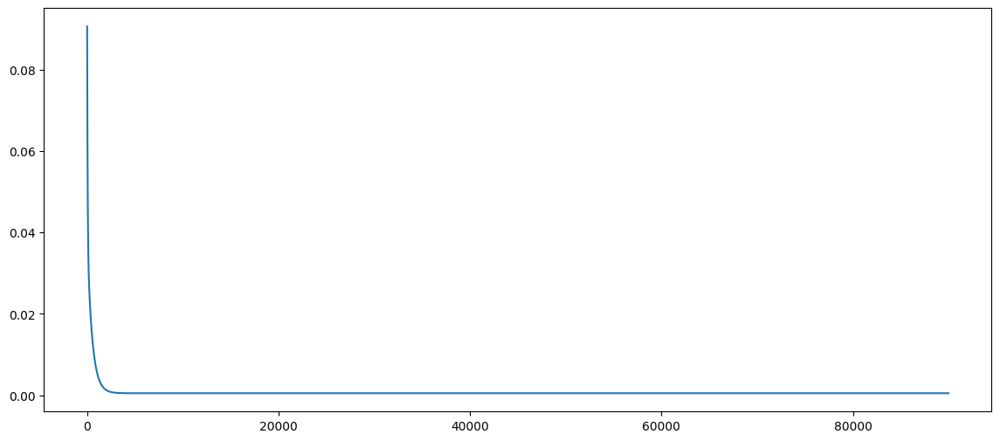
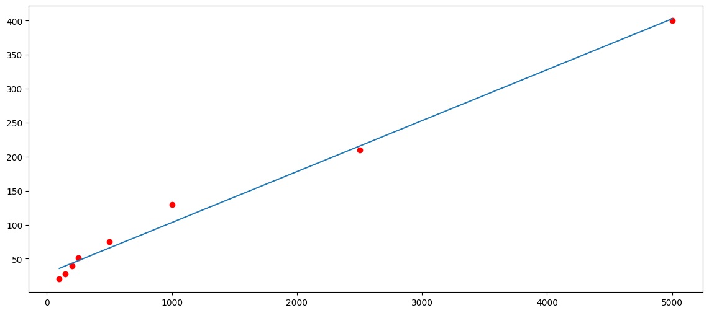

# Linear Regression (One Feature and m Training Examples)
In linear regression, we intend to fit a straight line from the given data if there is only one feature. So, we assume a function which generalizes one straight line.

## Linear Model: Input and Output
In some of the text, we call this assumed linear function as hypothesis as hypothesis is an idea that is suggested as the possible explanation for something but has not yet been found to be true or correct.

If we use $\mathbf{𝐱^{(𝐢)}}$  to denote the feature vector for $\mathbf{i^{th}}$ training example and $w$ and $b$ as the model parameters, we can write the hypothesis as below:

$h(x)=wx^{(i)}+b$

Let us have $m$ training example then  $𝐢=1,2,3,...m$ and write $\hat{y}$ for the prediction from the hypothesis.

$\hat{y}^{(i)} = wx^{(i)}+b $

### Example Data

| Size | Price (L) |
| :---:|   :---:   |
| 100  | 20  |
| 150  | 28  |
| 200  | 39  |
| 250  | 51  |
| 500  | 75  |
| 1000 | 130 |
| 2500 | 210 |
| 5000 | 400 |

$m=8; nx=1$

Import the required modules
```js
import numpy as np
from matplotlib import pyplot as plt
```

```js
nx=1
size=np.array([100, 150, 200, 250, 500, 1000, 2500, 5000])
price=np.array([20, 28, 39, 51, 75, 130, 210, 400])
print(size,"\n", price)
m=price.shape[0]
print(m)
```
> 8
## Setting the Matrices as per Notation
For $nx$ features and $m$ training examples, we can write the linear model as below:

$\hat{\mathbf{y}} = \mathbf{w^T X+b}$

The correct matrix notations are explained as under:

- We arrange all featues of a particular training example vertically in a column and arrange all training examples horizontally or stack all training examples in different columns. So the shape of the feature vector of a training example ($\mathbf{x}$) is $(nx,1)$ and the shape of feature matrix ($\mathbf{X}$) is $(nx, m)$.

  $\mathbf{x}$.shape=($nx, 1$); $\mathbf{X}$.shape=($nx, m$)

- The labels of the data are also arranged in the same manner. There is only one label for one input data set. So, there would be a single row and we arrange all the labels for training examples horizontally or stack them in different columns. This gives the shape of output vector ($\mathbf{y}$) as $(1, m)$

  $\mathbf{y}$.shape=($1,m$)

```js
#Reshaping the Input
X=size.reshape(1,m)
y=price.reshape(1,m)
```
> (8,)  
> (8,)
- The weight matrix $\mathbf{w}$ and $\mathbf{b}$ are arranged as per below shapes to facilitate the vector and broadcasting operation.

  $\mathbf{w}$.shape=($nx,1$)

  $\mathbf{b}$.shape=($1,1$)

```js
#Initializing Weights and Biases
w=np.random.rand(nx).reshape(nx,1)
b=np.random.rand(nx).reshape(1,1)
print(X.shape, w.shape, b.shape)
```
> (1, 8) (1, 1) (1, 1)

It is just to reiterate that we write $\hat{\mathbf{y}} = \mathbf{w^T X+b}$ for all the training examples and we write the prediction as $\hat{y} = \mathbf{w^T x+b}$ for a particular training example.
 In this case, the shape of the $\mathbf{x}$ is $(nx,1)$ and for one feature it would be $(1,1)$.

We feed training set to the learning algorithm. The algorithm then computes a linear function f(x) that takes size of a house as input and tries to output the estimated price of y for the corresponding house.

Let us substitute the data


$\hat{y}^{(1)} = wx^{(1)}+b = w(100)+b $      `First Training Example`.

$\hat{y}^{(2)} = wx^{(2)}+b = w(150)+b $      `Second Training Example`.

.....

$\hat{y}^{(8)} = wx^{(8)}+b = w(5000)+b $     `Eighth Training Example`

```js
yhat=np.dot(w.T, X) + b
print(yhat)
```
> [[59.68973141 89.27801415 118.86629688  148.45457962 296.39599329 592.27882064 1479.9273027 2959.34143945]]


*Your output may be different as w and b are initialized using random function*

## Cost Function

In linear regression, we have to come up with parameters w and b so that the straight line fits the data well.
- Choose $w$ and $b$ so that $\hat{y}$ is close to y for all values of x
- ($\hat{y}-y)$ is the difference between output price of the house from the hypothesis and the actual price of the house.
- So, the objective function for this minimization problem can be formulated as below

  $J(\mathbf{w},b)=\frac{1}{2m}\sum \limits _{i=1} ^{m} (\hat{y}^{(i)}-y^{(i)})^{2} $

- The cost function sometimes called as “Squared error function” or "Mean squared error".
- The objective function $J(w,b)$ for this optimization problem is also called as “Cost function” in linear regression.


**Our aim is to minimize the cost function,** $J(w,b)$

Start with some assumed value of $w$ and $b$ and evaluate $J(w,b)$

Let us drop $b$ to simplify our expression to visulize the plot of cost function in 2D i.e. cost as a function of weight only.

```js
error_squared=(1/(2*m))*np.power((yhat-y),2)
J=np.sum(error_squared, axis=1)
# J=np.sum(np.multiply((yhat-y), (yhat-y)), axis=1)
# J=np.dot((yhat-y), (yhat-y).T)
print(f' The Cost for the iteration is {J}')
```
>  The Cost for the iteration is [14423.6925874]

## Gradient Descent

$ \frac{\partial J}{\partial w} = \frac{1}{m} \sum \limits _{i=1} ^m (\hat {y}^{(i)}-y^{(i)})x$

$ \frac{\partial J}{\partial b} = \frac{1}{m} \sum \limits _{i=1} ^m (\hat {y}^{(i)}-y^{(i)})$

```js
dw=np.sum(np.multiply(X[0], (yhat-y)), axis=1)
print(f'Derivative wrt w1 = {dw1}')
db=(1/m)*np.sum((yhat-y), axis=1)
print(f'Derivative wrt b = {db}')
```
> Derivative wrt w1 = [-2712451.875]
> Derivative wrt b = [-118.8271875]

$ \frac{\partial J}{\partial w} = \frac{1}{m} [(\hat {y}^{(1)}-y^{(1)}){x}^{(1)} + (\hat {y}^{(2)}-y^{(2)}){x}^{(2)} + (\hat {y}^{(3)}-y^{(3)}){x}^{(3)}+ ..... + (\hat {y}^{(m)}-y^{(m)}){x}^{(m)}]$

$ \frac{\partial J}{\partial w} = \frac{1}{m} \begin{pmatrix}
{x}^{(1)} & {x}^{(2)} & ⋯ & {x}^{(m)}
\end{pmatrix}\begin{pmatrix}
\hat {y}^{(1)}-y^{(1)}\\
\hat {y}^{(2)}-y^{(2)}\\
\vdots \\
\hat {y}^{(m)}-y^{(m)}
\end{pmatrix}$

$ \frac{\partial J}{\partial w} = \frac{1}{m} \mathbf{x}(\mathbf {\hat {y}-y})^T$

```js
dw=np.dot(X, (yhat-y).T)
print(f'Derivative wrt w = {dw}')
```
> Derivative wrt w = [[-2712451.875]]

**Updating Parameters**

  $\mathbf{w} := \mathbf{w} - \alpha \frac {\partial{\mathbf{J}}}{\partial {\mathbf{w}}}$

  ${\mathbf{b}} := {\mathbf{b}} - \alpha \frac {\partial {\mathbf{J}}}{\partial {\mathbf{b}}}$

Where,
    $ \alpha$ : Learning Rate (0.0001, 0.001, 0.01...).

Update parameters simultaneously for correct implementation of Gradient Descent

```js
learning_rate=0.01
w=w-learning_rate*dw
b=b-learning_rate*db
print(f'Update values of w = {w}')
print(f'Update values of b = {b}')
```
> Update values of w = [[-165979.40674246]]
> Update values of b = [[-5.47587428]]

## Normalization

```js
X_norm=X/np.max(X)
y_norm=y/np.max(y)
print(f'Normalized X = {X_norm}')
print(f'Normalized y = {y_norm}')
```
> Normalized X = [[0.02 0.03 0.04 0.05 0.1  0.2  0.5  1.  ]]
> Normalized y = [[0.05   0.07   0.0975 0.1275 0.1875 0.325  0.525  1.    ]]
## Final Code

```js
learning_rate=0.01
max_iteration=9000
cost=np.zeros((max_iteration))
#print(X_norm)
w=np.zeros(nx).reshape(nx,1)
b=np.zeros(1).reshape(1,1)
for i in range(max_iteration):
  yhat=linear(X_norm,w,b)
  #print("y_hat = ", yhat.shape)
  error=np.subtract(yhat,y_norm)
  #print(error, error.shape)
  error_squared=np.power(error,2)
  #J=np.sum(error_squared, axis=1)
  #J=np.sum(np.multiply((yhat-y), (yhat-y)), axis=1)
  J=np.dot((yhat-y_norm), (yhat-y_norm).T)
  cost[i]=np.squeeze(J)/(2*m) # All three implementation will work
  #print(cost[i])
  #dw_sum=np.sum(X_norm*(yhat-y),axis=1)
  #print("dw_sum ", dw_sum)
  #dw=dw_sum/m
  dw=(1/m)*np.dot(X_norm,(yhat-y_norm).T)
  db=(1/m)*np.sum((yhat-y_norm), axis=1)
  w=w-learning_rate*dw
  b=b-learning_rate*db
  #print(b.shape)
print(w, b)
```
> [[0.93629975]] [[0.07076313]]

*These results should match as the weights and bias are initialized using zeros.*

## Code for Plotting Data

```js
xPlot=np.linspace(1,max_iteration, num=max_iteration)
print(xPlot.shape, cost.shape)
plt.plot(xPlot, cost)
```


```js
def predict(w,b,x):
  return w*x+b
```
Let us predict the price of largest size flat. The normalized value would be 1.

```js
predict(w,b,1)*(np.max(y))
```
> array([[402.86202767]])

## Linear Regression using `MatplotLib`

```js
X_mpl=X.flatten()
y_mpl=y.flatten()
```

```js
# Using Matplotlib function for linear fiiting
plt.scatter(X_mpl,y_mpl,color="red")
linear_model=np.polyfit(X_mpl,y_mpl,1)
hypothesis =np.poly1d(linear_model)
print(hypothesis)
plt.plot(X_mpl,hypothesis(X_mpl))
plt.show()
print(hypothesis(5000))
np.asarray(hypothesis)
```


## Linear Regression using `SKLearn`

```js
from sklearn import linear_model
X=np.array([[100],[150],[200],[250],[500], [1000],[2500],[5000]])
y=np.array([20,28, 39, 51, 75, 130, 210, 400])
```

```js
# Create a Logistic Regression Object, perform Logistic Regression
lr = linear_model.LinearRegression()
lr.fit(X, y)
print(lr.coef_)
print(lr.intercept_)
```