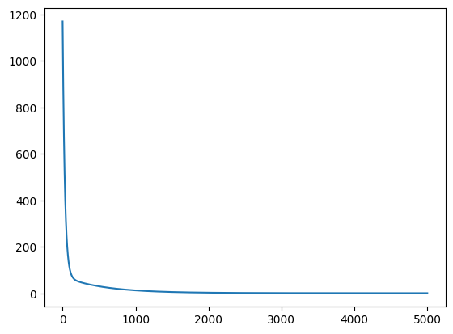

# Linear Regression (Multi Features and m Training Examples)

We will use $\mathbf{𝐱^{(𝐢)}}$  to denote the feature vector and  $\mathbf{𝐲^{(𝐢)}}$  to denote output variable for $\mathbf{i^{th}}$ training example.

$h(x)=w_1x^{(i)}_1+w_2x^{(i)}_2+.....+w_{nx}x^{(i)}_{nx}+b$

Where,

$m$ : training examples ($i=1$ to $m$)

$nx$ : Number of features

Let us write $\hat{y}$ for the prediction from the linear model.

$\hat{y}^{(i)} =  w_1 x^{(i)}_1  + w_2 x^{(i)}_2 + \cdots + w_{n_x} x^{(i)}_{n_x} + b$

Feature vector for $i^{th}$ training example:

$\mathbf{x}^{(i)} = \begin{pmatrix}{x}_1^{(1)} \\ {x}_2^{(2)} \\ \cdots \\ {x}_{nx}^{(m)} \end{pmatrix} $

Feature vector of the problem dataset:

$\mathbf{X} = \begin{pmatrix}\mathbf{x}^{(1)} & \mathbf{x}^{(2)} & \cdots & \mathbf{x}^{(m)}\end{pmatrix}$

$$ \mathbf{X} = \begin{pmatrix}{x}_1^{(1)} & {x}_1^{(2)} & \cdots & {x}_1^{(m)} \\
{x}_2^{(1)} & {x}_2^{(2)} & \cdots & {x}_2^{(m)} \\
\vdots & \vdots & \cdots & \vdots \\
{x}_{nx}^{(1)} & {x}_{nx}^{(1)} & \cdots & {x}_{nx}^{(m)} \end{pmatrix} $$


Parameter vector :
$\mathbf{w} =\begin{pmatrix} {w}_1 \\ {w}_2 \\ \vdots \\ {w}_{nx} \end{pmatrix}, b $

### Example Data

| Size      | Bedrooms | Price (L) |
| :---:     | :----:   |   :---:   |
| 100       | 1        | 20        |
| 150       | 2        | 28        |
| 200       | 3        | 39        |
| 250       | 4        | 51        |
| 500       | 4        | 80        |

$m=5; nx=2$

Features for $3^{rd}$ training example:
$$x^{(3)}_1=200; x^{(3)}_2=3$$

Features vector for $2^{nd}$ training example:
$\mathbf{x}^{(2)} =\begin{pmatrix}
  150 \\ 2
 \end{pmatrix} $

Feature vector of the problem dataset:

$ \mathbf{X} = \begin{pmatrix}
\mathbf{x}^{(1)} & \mathbf{x}^{(2)} & \cdots & \mathbf{x}^{(5)}
\end{pmatrix}$

$ \mathbf{X} = \begin{pmatrix}
100 & 150 & 200 & 250 & 500 \\ 1 & 2 & 3 & 4 & 4
\end{pmatrix}$

Parameter vector :
$ \mathbf{w} = \begin{pmatrix}
w_{1} \\ w_{2}
\end{pmatrix}, b$

Output vector (Given/Labelled) :
$\mathbf {y} = \begin{pmatrix}
y^{(1)} & y^{(2)} & \cdots & y^{(m)}
\end{pmatrix} = \begin{pmatrix}
20 & 28 & 39 & 53 & 80
\end{pmatrix}$

Output vector (Prediction):
$\mathbf {\hat{y}} = \begin{pmatrix}
\hat{y}^{(1)} & \hat{y}^{(2)} & \cdots & \hat{y}^{(m)}
\end{pmatrix} $

```js
import numpy as np
import matplotlib.pyplot as plt
X=np.array([[100,150, 200, 250, 500], [1,2,3,4,5]])
y=np.array([20,28, 39, 51, 80])
#print(X,"\n", y)
```

We can use output of `X.shape` to find the features and training examples.

```js
#Calculate Number of Examples (m) and Features (nx)
nx=X.shape[0]
m=X.shape[1]
print("Features nx = ", nx, "\nTraining Examples m = ",m)
#Reshaping the output label
y=y.reshape(1,m)
```
> Features nx =  2  
> Training Examples m =  5

**Note:** *X.reshape is not required as its already in correct shape*
**Predicted Values**

$\hat{y}^{(1)} = w_1x^{(1)}_1+w_2x^{(1)}_2+b = \mathbf {w}^T \mathbf {x}^{(1)} + b $

$\hat{y}^{(2)} = w_1x^{(2)}_1+w_2x^{(2)}_2+b = \mathbf {w}^T \mathbf {x}^{(2)} + b $

$\hat{y}^{(3)} = w_1x^{(3)}_1+w_2x^{(3)}_2+b = \mathbf {w}^T \mathbf {x}^{(3)} + b $

$\hat{y}^{(4)} = w_1x^{(4)}_1+w_2x^{(4)}_2+b = \mathbf {w}^T \mathbf {x}^{(4)} + b $

$\hat{y}^{(5)} = w_1x^{(5)}_1+w_2x^{(5)}_2+b = \mathbf {w}^T \mathbf {x}^{(5)} + b $


$\mathbf{\hat{y}} = \mathbf {w}^T \mathbf {X} + b $


**Data substitution**

$\hat{y}^{(1)} = w_1x^{(1)}_1+w_2x^{(1)}_2+b = w_1(100)+w_2(1) + b $

$\hat{y}^{(2)} = w_1x^{(2)}_1+w_2x^{(2)}_2+b = w_1(150)+w_2(2) + b $

$\hat{y}^{(3)} = w_1x^{(3)}_1+w_2x^{(3)}_2+b = w_1(200)+w_2(3) + b $

$\hat{y}^{(4)} = w_1x^{(4)}_1+w_2x^{(4)}_2+b = w_1(250)+w_2(4) + b $

$\hat{y}^{(5)} = w_1x^{(5)}_1+w_2x^{(5)}_2+b = w_1(500)+w_2(4) + b $

```js
#Initializing Weights and Biases
w=np.random.rand(nx).reshape(nx,1)
b=np.random.rand(1).reshape(1,1)
print(w,b)
```
> [[0.72996411][0.40877077]] [[0.22401676]]

${\hat{y}} =\mathbf{w}^T \mathbf{X}+b$

```js
yhat=np.dot(w.T, X) + b
print(yhat)
```
> [[ 73.62919806 110.5361741  147.44315013 184.35012617 367.24992326]]

## Cost Function
$J(\mathbf{w},b)=\frac{1}{2m}\sum \limits _{i=1} ^{m} (\hat{y}^{(i)}-y^{(i)})^{2} $
$J(\mathbf{w},b)=\frac{1}{2m}\sum \limits _{i=1} ^{m} ((\mathbf{w}^T \mathbf{x}^{(i)}+b)-y^{(i)})^{2} $

Start with some assumed value of $\mathbf{w}$ and $b$ and evaluate $J(\mathbf{w},b)$

$J(w_1, w_2,b)=\frac{1}{2m}[(100w_1+w_2+b-20)^2+(150w_1+2w_2+b-28)^2+(200w_1+3w_2+b-39)^2+(250w_1+4w_2+b-51)^2+(500w_1+4w_2+b-80)^2]$

```js
error_squared=(1/(2*m))*np.power((yhat-y),2)
J=np.sum(error_squared, axis=1)
# J=np.sum(np.multiply((yhat-y), (yhat-y)), axis=1)
# J=np.dot((yhat-y), (yhat-y).T)
print(f' The Cost for the iteration is {J}')
```
> The Cost for the iteration is [12174.30022923].  

**Our aim is to minimize the cost function,** $J(\mathbf{w},b)$

## Gradient Descent
$ \frac{\partial J}{\partial w_j} = \frac{1}{m} \sum \limits _{i=1} ^m (\hat {y}^{(i)}-y^{(i)}){x}^{(i)}_j$

$ \frac{\partial J}{\partial b} = \frac{1}{m} \sum \limits _{i=1} ^m (\hat {y}^{(i)}-y^{(i)})$


**Substituting**

$ \frac{\partial J}{\partial w_1} = \frac{1}{m} [(\hat {y}^{(1)}-y^{(1)}){x}^{(1)}_1 + (\hat {y}^{(2)}-y^{(2)}){x}^{(2)}_1 + (\hat {y}^{(3)}-y^{(3)}){x}^{(3)}_1+(\hat {y}^{(4)}-y^{(4)}){x}^{(4)}_1 + (\hat {y}^{(5)}-y^{(5)}){x}^{(5)}_1]$

$ \frac{\partial J}{\partial w_2} = \frac{1}{m} [(\hat {y}^{(1)}-y^{(1)}){x}^{(1)}_2 + (\hat {y}^{(2)}-y^{(2)}){x}^{(2)}_2 + (\hat {y}^{(3)}-y^{(3)}){x}^{(3)}_2+(\hat {y}^{(4)}-y^{(4)}){x}^{(4)}_2 + (\hat {y}^{(5)}-y^{(5)}){x}^{(5)}_2]$

```js
#print(f'X {X}')
#print(f'error {yhat-y}')
dw1=np.sum(np.multiply(X[0], (yhat-y)), axis=1)
print(f'Derivative wrt w1 = {dw1}')
dw2=np.sum(np.multiply(X[1], (yhat-y)), axis=1)
print(f'Derivative wrt w2 = {dw2}')
```
> Derivative wrt w1 = [216394.46911967]   
> Derivative wrt w2 = [2513.68111764]

$ \frac{\partial J}{\partial b} = \frac{1}{m} [(\hat {y}^{(1)}-y^{(1)}) + (\hat {y}^{(2)}-y^{(2)}) + (\hat {y}^{(3)}-y^{(3)})+(\hat {y}^{(4)}-y^{(4)}) + (\hat {y}^{(5)}-y^{(5)})]$

```js
db=(1/m)*np.sum((yhat-y), axis=1)
print(f'Derivative wrt b = {db}')
```
> Derivative wrt b = [133.04171434]

$ \frac{\partial J}{\partial w_1} = \frac{1}{m} \begin{pmatrix} {x}^{(1)}_1 & {x}^{(2)}_1 & {x}^{(3)}_1 & {x}^{(4)}_1 & {x}^{(5)}_1 \end{pmatrix} \begin{pmatrix} \hat {y}^{(1)}-y^{(1)} \\ \hat {y}^{(2)}-y^{(2)}\\ \hat {y}^{(3)}-y^{(3)} \\ \hat {y}^{(4)}-y^{(4)} \\ \hat {y}^{(5)}-y^{(5)} \end{pmatrix}$

$$ \frac{\partial J}{\partial w_1} = \frac{1}{m} \mathbf{x}_{(1)}(\mathbf{\hat {y}-y})^T$$

```js
dw1=np.dot(X[0], (yhat-y).T)
print(f'Derivative wrt w1 = {dw1}')
```
> Derivative wrt w1 = [216394.46911967]

$ \frac{\partial J}{\partial w_2} = \frac{1}{m} \begin{pmatrix} {x}^{(1)}_2 & {x}^{(2)}_2 & {x}^{(3)}_2 & {x}^{(4)}_2 & {x}^{(5)}_2 \end{pmatrix} \begin{pmatrix} \hat {y}^{(1)}-y^{(1)}\\ \hat {y}^{(2)}-y^{(2)}\\ \hat {y}^{(3)}-y^{(3)}\\ \hat {y}^{(4)}-y^{(4)}\\ \hat {y}^{(5)}-y^{(5)} \end{pmatrix}$

$$ \frac{\partial J}{\partial w_2} = \frac{1}{m} \mathbf{x}_{(2)}(\mathbf{\hat {y}-y})^T$$

```js
dw2=np.dot(X[1], (yhat-y).T)
print(f'Derivative wrt x2 = {dw2}')
```
> Derivative wrt x2 = [2513.68111764]

$ \frac {\partial J}{\partial \mathbf{w}} = \begin{pmatrix} \frac{\partial J}{\partial w_1} \\ \frac{\partial J}{\partial w_2} \end{pmatrix}$

$ \frac {\partial J}{\partial \mathbf{w}} = \frac{1}{m}\begin{pmatrix} {x}^{(1)}_1 & {x}^{(2)}_1 & {x}^{(3)}_1 & {x}^{(4)}_1 & {x}^{(5)}_1 \\ {x}^{(1)}_2 & {x}^{(2)}_2 & {x}^{(3)}_2 & {x}^{(4)}_2 & {x}^{(5)}_2 \end{pmatrix}\begin{pmatrix} \hat {y}^{(1)}-y^{(1)}\\ \hat {y}^{(2)}-y^{(2)}\\ \hat {y}^{(3)}-y^{(3)}\\ \hat {y}^{(4)}-y^{(4)}\\ \hat {y}^{(5)}-y^{(5)} \end{pmatrix}$

$ \frac {\partial J}{\partial \mathbf{w}} =\frac{1}{m} \mathbf {X} (\mathbf{\hat {y}-y})^{T} $

```js
dw=np.dot(X, (yhat-y).T)
print(f'Derivative wrt X = {dw}')
print(f'Derivative wrt b = {db}')
```
> Derivative wrt X = [[216394.46911967]
 [  2513.68111764]]  
> Derivative wrt b = [133.04171434]


**Updating Parameters**

$ w_1 = w_1 - \alpha \frac {\partial J}{\partial w_1}$

$ w_2 = w_2 - \alpha \frac {\partial J}{\partial w_2}$

In vector form

$ \mathbf{w} = \mathbf{w} - \alpha \frac {\partial J}{\partial \mathbf{w}}$

$ b = b - \alpha \frac {\partial J}{\partial b}$

Where,
        $ \alpha$ : Learning Rate (0.0001, 0.001, 0.01...)

```js
learning_rate=0.01
w=w-learning_rate*dw
b=b-learning_rate*db
print(f'Update values of w = {w}')
print(f'Update values of b = {b}')
```
> Update values of w = [[-2163.21472709]
 [  -24.7280404 ]]  
> Update values of b = [[-1.10640038]]

1. Arrange the input feature matrix $ \mathbf{X}.shape = (nx \times m)$
2. Arrange the output vector $\mathbf{y}.shape=(1 \times m)$
3. Assume learning rate and number of iterations
4. Initialize the weight vector $\mathbf{w}.shape=(nx \times 1)$ We can initialize these with `zeros` for linear regression.
5. Initialize the bias as zero (scalar or 1D of size 1 or 2D array or size 1,1)
6. Loop over iteration
- (a) Calculate predicted value array for assumed/updated parameters
$ \mathbf{\hat{y}}=\mathbf{w}^{T}\mathbf{X}+b$
- (b) Calculate the loss $J(w,b)=\frac{1}{2m}\sum \limits _{i=1} ^{m} (\hat{y}^{(i)}-y^{(i)})^{2} $
- (c) Calculate the partial derivative of Cost Function with
respect to weights
$ \frac{\partial J}{\partial w} = \frac{1}{m} \mathbf{X}(\mathbf{\hat {y}-y})^T$
- (c) Calculate the partial derivative of Cost Function with respect to bias. This is evaluated by summing the difference of predicted value and actual value and taking mean.
$ \frac{\partial J}{\partial b} = \frac{1}{m} Sum(\mathbf{\hat {y}-y})^T$
- (d) Update the weight and bias


  $\mathbf{w} := \mathbf{w} - \alpha \frac {\partial{\mathbf{J}}}{\partial {\mathbf{w}}}$

  $ {\mathbf{b}} := {\mathbf{b}} - \alpha \frac {\partial {\mathbf{J}}}{\partial {\mathbf{b}}}$

## Final Code

```js
#X_norm=X/np.max(X, axis=1)
X_norm=X/np.max(X, axis=1, keepdims=True)
y_norm=y/np.max(y, axis=1, keepdims=True)
print(X_norm)
print(y_norm)

def linear(X,w,b):
  return np.dot(w.T,X)+b

learning_rate=0.01
max_iteration=5000
cost=np.zeros((max_iteration))
#print(X_norm)
w=np.zeros(nx).reshape(nx,1)
b=np.zeros(1).reshape(1,1)
for i in range(max_iteration):
  yhat=linear(X_norm,w,b)
  #print("y_hat = ", yhat.shape)
  error=np.subtract(yhat,y)
  #print(error, error.shape)
  error_squared=np.power(error,2)
  #J=np.sum(error_squared, axis=1)
  #J=np.sum(np.multiply((yhat-y), (yhat-y)), axis=1)
  J=np.dot((yhat-y), (yhat-y).T)
  cost[i]=J/(2*m) # All three implementation will work
  #print(cost[i])
  #dw_sum=np.sum(X_norm*(yhat-y),axis=1)
  #print("dw_sum ", dw_sum)
  #dw=dw_sum/m
  dw=(1/m)*np.dot(X_norm,(yhat-y).T)
  db=(1/m)*np.sum((yhat-y), axis=1)
  w=w-learning_rate*dw
  b=b-learning_rate*db
  #print(b.shape)
print(w, b)
```
> [[0.60905902] [0.34562507]] [[0.04527638]]

## Learning Curve
```js
xPlot=np.linspace(1,max_iteration, num=max_iteration)
print(xPlot.shape, cost.shape)
plt.plot(xPlot, cost)
```


```js
def predict(w,b,x):
  return np.dot(w.T,x)+b
```

```js
predict(w,b,[1.9,1.9])*(np.max(y)
```
> array([[79.99683797]])
