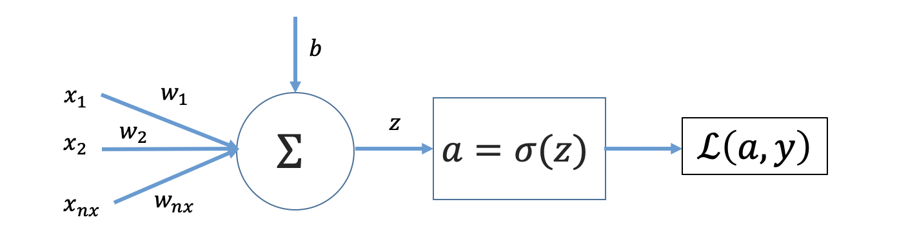
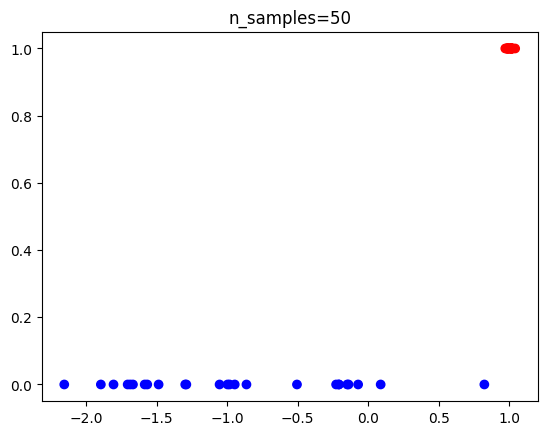
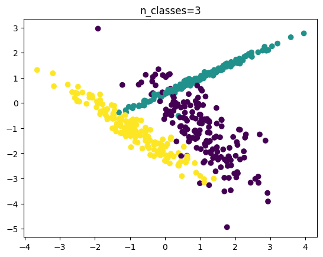
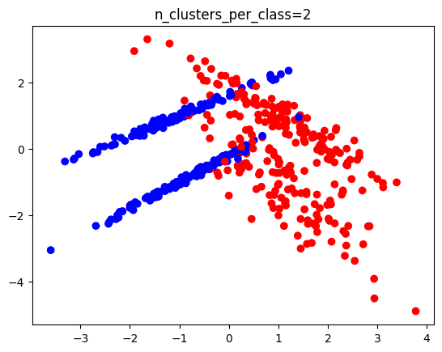
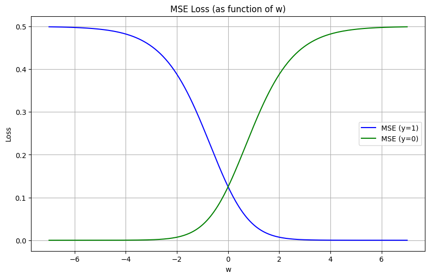
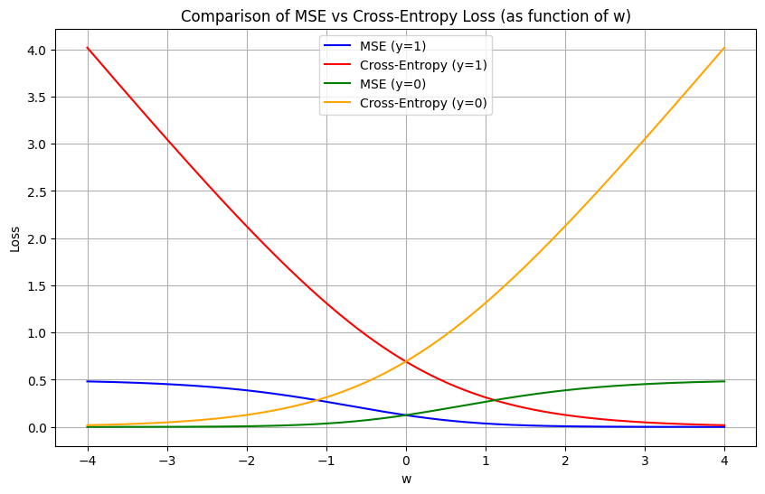

## Binary Classification using Logistic Rgression

Logistic Regression is similar to the Linear Regression except linear Regression is used to solve Regression problems, whereas Logistic regression is used to solve the classification problems. Logistic regression predicts the output of a categorical dependent variable. It can be either `Yes` or `No`, `0` or `1`, `true` or `False`, etc. but instead of giving the exact value as 0 and 1, it gives the `probabilistic values` which lie between 0 and 1.

1. Logistic Regression is a statistical model that uses Logistic Function to model a binary classification problem
2. `Logistic function` takes values either 0 or 1 when parameter is very large or small.
3. In Logistic Rgression, we intend to estimate the model parameters such that the probability of the output is true given the input features.

$\hat{y}=P(y=1|x)$

The probability is always between 0 and 1. So,

$0 \le \hat{y} \le 1$

## Setting up Problem

Let,  
$m$ : training examples  
$nx$ : Number of features  



We will use $\mathbf{𝐱}^{(𝐢)}$  to denote the feature vector and  $\mathbf{𝐲}^{(𝐢)}$ to denote output variable.
Let us write $z$ for the output as linear combinations of weights and input features.

$z^{(i)} = w_1x^{(i)}_1+w_2x^{(i)}_2+.....+w_{nx}x^{(i)}_{nx}+b $   

Feature vector for $i^{th}$ training example:

$\mathbf{x}^{(i)} =\begin{pmatrix}{x}_1^{(i)} \\ {x}_2^{(i)} \\ \vdots \\ {x}_{nx}^{(i)}\end{pmatrix}$   

Output vector of $i^{th}$ training example:   

$y^{(i)}$ = (0 or 1)

$ \mathbf{y} = \begin{pmatrix} {y}^{(1)} & {y}^{(2)} & \cdots & {y}^{(m)}\end{pmatrix}$ 

Feature vector of the problem dataset:   

$ \mathbf{X} = \begin{pmatrix}\mathbf{x}^{(1)} & \mathbf{x}^{(2)} & \cdots & \mathbf{x}^{(m)}\end{pmatrix}$   

$ \mathbf{X} = \begin{pmatrix}{x}_1^{(1)} & {x}_1^{(2)} & \cdots & {x}_1^{(m)} \\ {x}_2^{(1)} & {x}_2^{(2)} & \cdots & {x}_2^{(m)} \\ \vdots & \vdots & \cdots & \vdots \\ {x}_{nx}^{(1)} & {x}_{nx}^{(2)} & \cdots & {x}_{nx}^{(m)} \end{pmatrix}$

Parameter vector :

$\mathbf{w} =\begin{pmatrix} {w}_1 \\ {w}_2 \\ \vdots \\ {w}_{nx} \end{pmatrix}, b $

## Generate dataset for Logistic Regression

Before going further deeper into the logistic regression problem, let us first talk about the dataset that you will be using in the session. You can use dataset of your own, but we will introduce `sklearn` library for generating synthetic data for a classification problem.

- Will use `make_classification` from `sklearn` classification dataset to generate random data.

```js
import numpy as np
import matplotlib.pyplot as plt
from sklearn.datasets import make_classification
```

['make_classification' Documentation](https://scikit-learn.org/stable/modules/generated/sklearn.datasets.make_classification.html)

*Important Parameters:*

- n_samples: (int) The number of samples (default=100)
- n_features: (int) The total number of features ( default=20)
- n_classes: (int) The number of classes (or labels) of the classification problem (default=2)
- random_state: (int) Determines random number generation for dataset creation. Pass an int for reproducible output across multiple function calls. (default=None)
- return_X_y: (bool) If True, a tuple (X, y) instead of a Bunch object is returned (default=True)

```js
X, y = make_classification(
    n_samples=50, 
    n_features=1, 
    n_informative=1,
    n_redundant=0, 
    n_classes=2, 
    n_clusters_per_class=1)
```

It is must to assign the values of `n_informative` and `n_redundant` to satisfy the condition:

> n_features $\ge$ n_informative + n_redundant + n_repeated

Another important condition that must be satisfied is:

> n_classes * n_clusters_per_class $\le$ 2**n_informative

```js
def plot_scatter(X, y, dim):
  if dim == 1 :
    plt.scatter(X, y, c=y, cmap='bwr')
  elif dim == 2:
    plt.scatter(X[:,0], X[:,1], c=y, cmap='viridis')
  else :
    return
  plt.show()
```
```js
plot_scatter(X, y, 1)
```



**Note** : your data may be different as the samples are randomly generated.

The size of X is (n_samples, n_features), so, in this case, it is (100, 20)

For our use the X matrix needs to be transposed to make it (20,100) i.e ($n_x$, $m$). The 100 is the default features and 20 is the default number of features.

```js
X, y = make_classification(
    n_samples=500, 
    n_features=2, 
    n_informative=2,
    n_redundant=0, 
    n_classes=3, 
    n_clusters_per_class=1,
    random_state=42)
plot_scatter(X, y, 2)
```
In the figure below, the classes are three in different colors (Yellow, Green and Brown). In this case the plot should exactly match as we have used seed based random generator as specified by `random_state`. The seed is `42`.



```js
X, y = make_classification(
    n_samples=500, 
    n_features=2, 
    n_informative=2,
    n_redundant=0, 
    n_classes=2, 
    n_clusters_per_class=2,
    random_state=42)

plot_scatter(X, y, 2)
```

In the figure below, there are 2 classes in two different colors (Red and Blue) and each classes are having two sub-classes. The plot should exactly match in this case also.



```js
X_orig, y_orig = make_classification(
    n_samples=50,
    n_features=1,
    n_informative=1,
    n_redundant=0,
    n_classes=2,
    n_clusters_per_class=1,
    random_state=4)

    plot_scatter(X, y, 2)
```

## Setting Input Data as per Notation


The shape of the feature matrix is ($m, nx$). For our use, the X matrix needs to be transposed to make it ($nx, m$). So, first task is to arrange the matrices as per our conventions and then we can split the data into training and testing data. Though the split should be based on the volume and type of data, but general convention is to split dataset in the ratio of 80:20 into training and testing.

You can use `train_test_split` method from `sklearn` for this.

```js
training_x, testing_x, training_y, testing_y = train_test_split(X_orig, y_orig, train_size=0.8, test_size=0.2, random_state=1)
m_train=training_x.shape[0]
m_test=testing_x.shape[0]

X_train=training_x.T
X_test=testing_x.T

y_train=training_y.reshape(1, m_train)
y_test=testing_y.reshape(1, m_test)
```

## Forward Propogation - Linear Output

Next, is to compute the linear output using $z^{(i)} = \mathbf{w}^T \mathbf{x}^{(i)} + b$ for $i^{th}$ training example. Before imlementing this, you need the initial values of weights and biases. There are number of methods for initialization. For now, you can implement zero initialization with appropriate shape (features in one column).

```js
import numpy as np
def initialize_with_zeros(features):
    w = np.zeros(features).reshape(features,1)
    b = 0.0
    return w, b

def forward_linear(x, w, b):
  z = np.dot(w.T, x) + b
  return z
```
## Forward Propogation - Activated Output

In Logistic regression, instead of fitting a regression line, we fit an "S" shaped logistic function, which predicts values between 0 and 1. This process is the second part of forward propogation and called activation process. The output of this is called activated output represented by $a^{(i)}$. For one neuron problem, this is also the preducted value ($\hat{y}^{(i)}$) for the inilized parameters $w$ and $b$.

$\hat{y}^{(i)} = a^{(i)} = σ (z^{(i)}) = \frac {1}{1+e^{-z^{(i)}}}$  

```js
def activation(z):
  return 1/(1 + np.exp(-z))
```
## Loss Function

### Mean Square Error (MSE)

The squared error function for the logistic function may result in non-convex function, hence, the other function is used as loss function for as below:

$$L(a^{(i)}, y^{(i)}) =  - y^{(i)}  \log(a^{(i)}) - (1-y^{(i)} )  \log(1-a^{(i)})$$  

The above cost function is covex and hence we can have a global minima.

Let us explore some more about these functions.

The squared error function for the logistic function may result in non-convex function.

$J(a,y)=\frac{1}{2m}\sum (a-y)^{2} $

Let consider a case of one feature ($nx=1$) and $x=1$, $b=0$ and $y=1$; also, ignoring the constant term of $2m$

- Case -1 : y =1
$$L(a,y)= (\frac {1}{1+e^{-w}}-1)^{2} $$

- Case -1 : y =0
$$L(a,y)= (\frac {1}{1+e^{-w}})^{2} $$

```js
# w axis
w = np.linspace(-7, 7, 400)
a = activation(w)

# Loss functions
loss_mse_y1 = 0.5 * (a - 1) ** 2
loss_mse_y0 = 0.5 * (a - 0) ** 2

# Plot
plt.figure(figsize=(10,6))

plt.plot(w, loss_mse_y1, label="MSE (y=1)", color="blue")
plt.plot(w, loss_mse_y0, label="MSE (y=0)", color="green")

plt.xlabel("w")
plt.ylabel("Loss")
plt.title("MSE Loss (as function of w)")
plt.legend()
plt.grid(True)
plt.show()
```


We can see the curves are not conves at all the points. So, we will assume another function known as binary cross entropy function for our logistic regression problem.

### Binary Cross Entropy (BCE) Loss

The binary cross entropy loss function is as below:

$$L(a^{(i)}, y^{(i)}) =  - y^{(i)}  \log(a^{(i)}) - (1-y^{(i)} )  \log(1-a^{(i)})$$  

The above cost function is covex and hence we can have a global minima.

```js
# w axis
w = np.linspace(-4, 4, 400)
a = activation(w)

# Loss functions
loss_mse_y1 = 0.5 * (a - 1) ** 2
loss_mse_y0 = 0.5 * (a - 0) ** 2

loss_bce_y1 = -np.log(a + 1e-19)
loss_bce_y0 = -np.log(1 - a + 1e-19)

# Plot
plt.figure(figsize=(10,6))

plt.plot(w, loss_mse_y1, label="MSE (y=1)", color="blue")
plt.plot(w, loss_bce_y1, label="Cross-Entropy (y=1)", color="red")
plt.plot(w, loss_mse_y0, label="MSE (y=0)", color="green")
plt.plot(w, loss_bce_y0, label="Cross-Entropy (y=0)", color="orange")

plt.xlabel("w")
plt.ylabel("Loss")
plt.title("Comparison of MSE vs Cross-Entropy Loss (as function of w)")
plt.legend()
plt.grid(True)
plt.show()
```



 - For y = 1, cross-entropy loss $L(w, y) =  - \log(w)$ is minimized when
$w \to \infty $

 - For y = 0, cross-entropy loss $L(w, y) =  - \log(1 - w)$ is minimized when $w \to -\infty $

So it seems like the optimizer would want to send w to both +∞ and −∞ at the same time.

The model doesn't optimize for just one sample — it minimizes the average loss over all samples:
For samples with y=1, the optimizer pushes their w higher and for samples with y=0, the optimizer pushes their w lower.

Since all predictions share the same weight vector w, the algorithm balances the updates so that points from different classes are separated. w aligns with the direction that best discriminates between the two classes.


## Cost Function for Logistic Regression

The sum of all the loss over entire training set is called the cost. The cost function is therefore computed by summing over all training examples:  

$$J(\mathbf{w},b) = \frac{1}{m} \sum_{i=1}^m L(a^{(i)}, y^{(i)})$$

$$J = -\frac{1}{m}\sum_{i=1}^{m}(y^{(i)}\log(a^{(i)})+(1-y^{(i)})\log(1-a^{(i)}))$$


```js
def compute_cost(A, y_train):
  return np.squeeze(-np.sum((y_train*np.log(A)+(1-y_train)*np.log(1-A)),axis=1))
```

The cost is to be minimized and the optimum parameters are to be evaluated. We can use gradient descent. The update rule is as below:  

$ \mathbf{w} = \mathbf{w} - \alpha \frac {\partial J}{\partial \mathbf{w}}$  

$ b = b - \alpha \frac {\partial J}{\partial b}$  

Where,  
    $ \alpha$ : Learning Rate (0.0001, 0.001, 0.01...)

The goal is to learn $w$ and $b$ by minimizing the cost function $J$

## Gradient Descent

To understand the basics of the gradient descent, let us consider one training example and multiple features. Then we can write the forward propogation equations by dropping the superscript $i$:

$z = w_1x_1+w_2x_2+.....+w_{nx}x_{nx}+b $  

$a = \frac {1}{1+e^{-z}}$  

$L(a, y) =  - y \log(a) - (1-y) \log(1-a)$  

To find the upated values of the parameters, we have to find the gradients $ \frac{\partial L(a, y)}{\partial w_j}$, $ \frac{\partial L(a, y)}{\partial b}$.

The loss function is a function of $a$ and $y$, so we have to use chain rule going backward from the last step to first step.   

Note that $a$ is a function of $z$ and $z$ is a function of $w$.

$\frac{\partial L(a, y)}{\partial w_j}= \frac{\partial L(a, y)}{\partial a} \frac{\partial a}{\partial z}  \frac{\partial z}{\partial w_j}$

Let us try to evaluate the each term separately.  

$\frac{\partial L(a, y)}{\partial a}=-\frac {y}{a}+\frac {(1-y)}{(1-a)}$

Using 
$\frac{\partial (\frac{u(x)}{v(x)})}{\partial y}=\frac {vu'-uv'}{v^2}$, we evaluate

$ \frac{\partial a}{\partial z}=\frac{\partial }{\partial z} (\frac {1}{1+e^{-z}}) = \frac {e^{-z}}{(1+e^{-z})^2}=\frac {1}{1+e^{-z}}\frac {1+e^{-z}-1}{1+e^{-z}} =a(\frac {1+e^{-z}}{1+e^{-z}} - \frac {1}{1+e^{-z}})$

$ \frac{\partial a}{\partial z}=a(1-a)$

$ \frac{\partial z}{\partial w_j}=x_j$

$\frac{\partial L(a, y)}{\partial w_j}= x_j(a-y)$

Similarly,

$\frac{\partial L(a, y)}{\partial b}= (a-y)$

Let us expand the expressions for $m$ training examples by taking the mean of the sum over all the training examples

$$ \frac{\partial J}{\partial w_j} = \frac{1}{m} \sum \limits _{i=1} ^m (a^{(i)}-y^{(i)}){x}^{(i)}_j$$  

$$ \frac{\partial J}{\partial b} = \frac{1}{m} \sum \limits _{i=1} ^m (a^{(i)}-y^{(i)})$$

**Substituting**

$ \frac{\partial J}{\partial w_1} = \frac{1}{m} [({a}^{(1)}-y^{(1)}){x}^{(1)}_1 + ({a}^{(2)}-y^{(2)}){x}^{(2)}_1 + .... + ({a}^{(m)}-y^{(m)}){x}^{(m)}_1]$

$ \frac{\partial J}{\partial w_1} = \frac{1}{m} [({a}^{(1)}-y^{(1)}){x}^{(1)}_2 + ({a}^{(2)}-y^{(2)}){x}^{(2)}_2 + .... + ({a}^{(m)}-y^{(m)}){x}^{(m)}_2]$

```js
A = forward_linear(X_train, np.array([1.0, 1.0]), 0.0)
yhat = forward_activation(A)
dw1=(np.sum(np.multiply(X_train[0], (A-y_train)), axis=1))*(1/m_train)
dw2=(np.sum(np.multiply(X_train[1], (A-y_train)), axis=1))*(1/m_train)
dw = np.array([dw1, dw2]).reshape(2,1)
print(f'Derivative wrt w = {dw}')
```

$ \frac{\partial J}{\partial b} = \frac{1}{m} [({a}^{(1)}-y^{(1)}) + ({a}^{(2)}-y^{(2)}) + .... + ({a}^{(m)}-y^{(m)})]$

```js
db=(1/m_train)*np.sum((A-y_train), axis=1)
print(f'Derivative wrt b = {db}')
```
$ \frac{\partial J}{\partial w_1} = \frac{1}{m} \begin{pmatrix} {x}^{(1)}_1 & {x}^{(2)}_1 & \cdots &{x}^{(m)}_1 &  \end{pmatrix}\begin{pmatrix} {a}^{(1)}-y^{(1)}\\ {a}^{(2)}-y^{(2)}\\ \vdots \\ {a}^{(m)}-y^{(m)} \end{pmatrix}$

$ \frac{\partial J}{\partial w_2} = \frac{1}{m} \begin{pmatrix} {x}^{(1)}_2 & {x}^{(2)}_2 & \cdots &{x}^{(m)}_2 &  \end{pmatrix}\begin{pmatrix} {a}^{(1)}-y^{(1)}\\ {a}^{(2)}-y^{(2)}\\ \vdots \\ {a}^{(m)}-y^{(m)} \end{pmatrix}$

$ \frac{\partial J}{\partial w_1} = \frac{1}{m} \mathbf{x}_{(1)}(\mathbf{\hat {y}-y})^T$

$ \frac{\partial J}{\partial w_2} = \frac{1}{m} \mathbf{x}_{(2)}(\mathbf{\hat {y}-y})^T$

$ \frac {\partial J}{\partial \mathbf{w}} = \begin{pmatrix} \frac{\partial J}{\partial w_1} \\ \frac{\partial J}{\partial w_2} \end{pmatrix}$

$ \frac {\partial J}{\partial \mathbf{w}} = \frac{1}{m} \begin{pmatrix}{x}_1^{(1)} & {x}_1^{(2)} & \cdots & {x}_1^{(m)} \\ {x}_2^{(1)} & {x}_2^{(2)} & \cdots & {x}_2^{(m)} \end{pmatrix} \begin{pmatrix} {a}^{(1)}-y^{(1)} \\ {a}^{(2)}-y^{(2)} \\ {a}^{(3)}-y^{(3)} \\ {a}^{(4)}-y^{(4)} \\ {a}^{(5)}-y^{(5)} \\ \vdots \end{pmatrix}$

In matrix form,  
$$ \frac{\partial J}{\partial \mathbf{w}} = \frac{1}{m}\mathbf {X(a-y)}^T$$

$$ \frac{\partial J}{\partial b} = \frac{1}{m} \sum_{i=1}^m (a^{(i)}-y^{(i)})$$

```js
def compute_gradient(x, A, y):
  dw = np.dot(x,(A-y).T)
  db = np.sum((A-y), dtype=np.float64, axis=1)
  return dw, db
```
```js
print(X_train.shape, A.shape)
dw, db = compute_gradient(X_train, A, y_train)
print(dw/m_train)
```


## Python implementation

```js
learning_rate=0.05
max_iteration=500
cost=np.zeros((max_iteration))

w, b = initialize_with_zeros(nx)

print(w, b)

for i in range(max_iteration):

  z = forward_linear(X_train, w, b)

  A = forward_activation(z)

  #print(A, A.shape)

  cost[i] = compute_cost(A, y_train)/m_train

  dw, db = compute_gradient(X_train, A, y_train)


  #print("Gradients dw, b", dw,db)

  w=w-learning_rate*dw/m_train
  b=b-learning_rate*db/m_train

# print(" Cost", cost)
print(w.shape, b.shape)
```

```js
# Plot learning curve (with costs)
plt.plot(cost)
plt.ylabel('cost')
plt.xlabel('iterations')
plt.title("Learning rate")
plt.show()
```

## Prediction Code

```js
A=1/(1+np.exp(-np.dot(w.T, X_train)))
Y_prediction_train=np.zeros((1,X_train.shape[1]))
for i in range(A.shape[1]):
  if A[0,i] > 0.5:
    Y_prediction_train[0,i]=1
  else:
    Y_prediction_train[0,i]=0
print("Training accuracy: {} %".format(100-np.mean(np.abs(Y_prediction_train-y_train))*100))
```

```js
A_pred = forward_activation(forward_linear(X_train, w, b))
y_pred = np.array([1 if pred > 0.5 else 0 for pred in A_pred[0]]).reshape(1, m_train)
print((np.sum(y_pred == y_train))/m_train)
```
```js
A=1/(1+np.exp(-np.dot(w.T, X_test)))
Y_prediction_test=np.zeros((1,X_test.shape[1]))
for i in range(A.shape[1]):
  if A[0,i] > 0.5:
    Y_prediction_test[0,i]=1
  else:
    Y_prediction_test[0,i]=0
print("Testing accuracy: {} %".format(100-np.mean(np.abs(Y_prediction_test-y_test))*100))
# print(y_train)
```