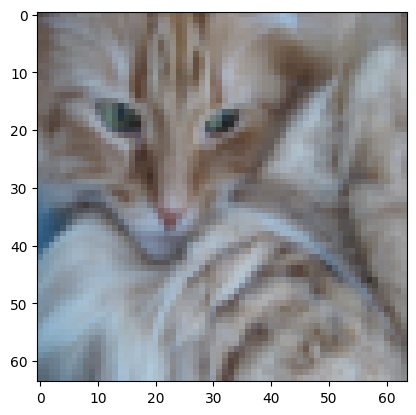

## Binary Classification using Logistic Rgression - Dataset

- Will use `kaggle` dataset of cat.
- The dataset is in HDF5 (Hierarchical Data Format version 5) data format
- [h5py Documentation Link](https://docs.h5py.org/en/stable/quick.html)
- HDF5 format is designed for storing and managing large and complex datasets.
- HDF5 provides a flexible and efficient way to organize, store, and retrieve data.
- It supports various types of data, including numerical arrays, images, tables, and text.
- The h5py package is a Pythonic interface to the HDF5 binary data format.

**Fetch Dataset from Kaggle**
- Download the data from the link below:  
  [Download Catvnocat Dataset](https://www.kaggle.com/datasets/muhammeddalkran/catvnoncat)
- Extract the zip file and keep that in a folder.  
- or, use the `kagglehub` code given on the link. The is as below

```js
import kagglehub
path = kagglehub.dataset_download("muhammeddalkran/catvnoncat")
print("Path to dataset files:", path)
```
This will output path variable as

<pre>Path to dataset files: /kaggle/input/catvnoncat</pre>

Check the list in the path using `!ls /kaggle/input/catvnoncat/`. You will see another folder names `catvnocat`. Chaeck the files inside this. Following two files are available:


  *Details of datasets*
  - Image size: 64x64
  - Color space: RGB
  - File format: h5
  - Number of classes: 2 (cat, non-cat)
  - Number of training images: 209
  - Number of testing images: 50

To represent color images, the red, green and blue channels (RGB) must be specified for each pixel, and so the pixel value is actually a vector of three numbers ranging from 0 to 255.

```js
import numpy as np
import h5py
import matplotlib.pyplot as plt
```

## Load Dataset

```js
train_dataset = h5py.File(f'{path}/catvnoncat/train_catvnoncat.h5', "r")
test_dataset = h5py.File(f'{path}/catvnoncat/test_catvnoncat.h5', "r")
```

 `h5py.File` acts like a Python dictionary, thus we can check the keys using `key()` method with list or `for loop`. [h5py Documentation Link](https://docs.h5py.org/en/stable/quick.html)

```js
print(f'Data Type {type(train_dataset)}')
print(f'Keys : {train_dataset.keys()}')
print(f'List containing keys only {list(train_dataset.keys())}')
```
```Output
Data Type <class 'h5py._hl.files.File'>
Keys : <KeysViewHDF5 ['list_classes', 'train_set_x', 'train_set_y']>
List containing keys only ['list_classes', 'train_set_x', 'train_set_y']
```
Key values are the `Groups` like a folder in file syatem.The groups contain dataset as files in the folders. 

```js
for key in train_dataset.keys():
    print(train_dataset[key], type(train_dataset[key]))
```
```output
<HDF5 dataset "list_classes": shape (2,), type "|S7"> <class 'h5py._hl.dataset.Dataset'>
<HDF5 dataset "train_set_x": shape (209, 64, 64, 3), type "|u1"> <class 'h5py._hl.dataset.Dataset'>
<HDF5 dataset "train_set_y": shape (209,), type "<i8"> <class 'h5py._hl.dataset.Dataset'>
```
The, `<class 'h5py._hl.dataset.Dataset'>` is not the data itself, but a handle (object) pointing to the dataset inside the HDF5 file. 

```js
print(type(train_dataset["train_set_y"]))
list(train_dataset["train_set_y"])
```
The list looks like a Numpy array, but it is not. To actually use the values, you typically convert it into a NumPy array.

```js
a=np.array(train_dataset["list_classes"])
print(a, a.dtype)
```
In NumPy, the `|S7` data type represents a fixed-length string of 7 characters. The S stands for string, and the number 7 indicates the length of the string. This data type is useful when you want to store and manipulate fixed-length strings in a NumPy array. Each element of the array will be a string of exactly 7 characters.

If you want to store a string of 4 characters in a NumPy array with the |S7 data type, you can do so by using a fixed-length string of length 7, where the remaining 3 characters are filled with spaces.

## Convert `h5py` Data into NumPy Data

```js
#train set features
train_set_x_orig = np.array(train_dataset["train_set_x"])

#train set labels
train_set_y = np.array(train_dataset["train_set_y"])

print(type(train_set_x_orig), type(train_set_y))
print(train_set_x_orig.dtype, train_set_y.dtype)

print(train_set_x_orig.shape)
print(train_set_y.shape)
print(train_set_y[0])
print(type(train_set_x_orig))

```
Shape of the feature matrix (`train_set_x_orig`) is **(209, 64, 64, 3)** and the shape of output label matrix (`train_set_y`) is **(209,)**.

```js
m_train=train_set_x_orig.shape[0]
m_test=test_set_x_orig.shape[0]
num_px=train_set_x_orig.shape[1]
num_py=train_set_x_orig.shape[2]
print ("Number of training examples: m_train = ", m_train)
print ("Number of testing examples: m_test = ",m_test)
print ("Size of image in pixels: num_px, num_py = " + str(num_px) + "," + str(num_py))
```
```output
Number of training examples: m_train =  209
Number of testing examples: m_test =  50
Size of image in pixels: num_px, num_py = 64,64
```

## Show cat image - MatPlotLib

```js
index = 2
plt.imshow(train_set_x_orig[index])
```


Chnage the index to show other images. You can also show the images in a grid

```js
for i in range(16):
  plt.subplot(4, 4, i+1)
  plt.imshow(test_set_x_orig[i])
  plt.axis('off')
```
This will show 16 images in 4 x 4 grid.


## Setting Data as per Matrix Notation
Our formulation takes all features in a single column and the training examples are to be arranged in different column. This makes a matrix of rows equals number of features and columns equals number of training examples. 

The shape of **`X`** matrix is $\mathcal {(nx, m)}$ where each columns represents the features of each training set; 

Where,   

$\mathcal {nx=px * py * 3}$ for the images as input and $m$ is the training examples.

So, we have to reshape to `train_set_x_orig` to `(nx,m_train)`. This will be achieved in two steps:   

***Step-1*** : Respahe `train_set_x_orig` to `(train_set_x_orig.shape[0],-1)`. -1 is used for unknown number of columns (known presently as `nx`)   
***Step-2*** : Transpose the matrix to get the desired dimension `(nx, m)`.

```js
train_set_x_flatten=train_set_x_orig.reshape(train_set_x_orig.shape[0],-1).T
test_set_x_flatten=test_set_x_orig.reshape (test_set_x_orig.shape[0],-1).T
```

Optimizing the parameters is best suited on the data of the same range. Let's normalize our dataset with the maximum possible pixel value i.e. 255.

```js
x_train = train_set_x_flatten / 255.
y_train=train_set_y
x_test = test_set_x_flatten / 255.
y_train.shape
```