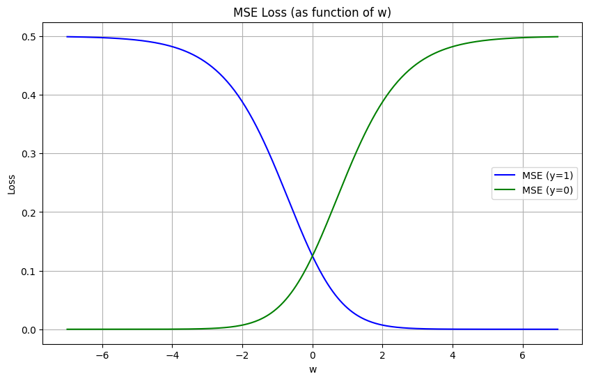
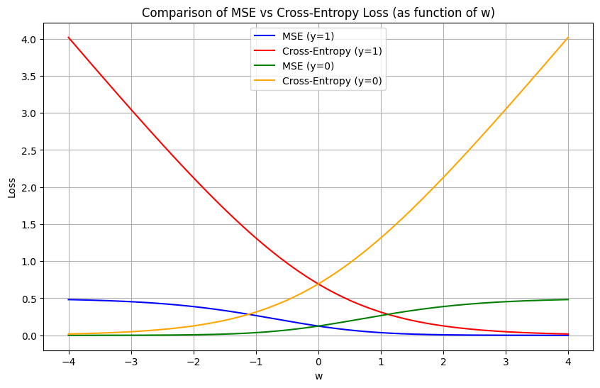

## Binary Classification using Logistic Rgression

Logistic Regression is similar to the Linear Regression except linear Regression is used to solve Regression problems, whereas Logistic regression is used to solve the classification problems. Logistic regression predicts the output of a categorical dependent variable. It can be either `Yes` or `No`, `0` or `1`, `true` or `False`, etc. but instead of giving the exact value as 0 and 1, it gives the `probabilistic values` which lie between 0 and 1.

1. Logistic Regression is a statistical model that uses Logistic Function to model a binary classification problem
2. `Logistic function` takes values either 0 or 1 when parameter is very large or small.
3. In Logistic Rgression, we intend to estimate the model parameters such that the probability of the output is true given the input features.

$\hat{y}=P(y=1|x)$

The probability is always between 0 and 1. So,

$0 \le \hat{y} \le 1$


## Mean Square Error (MSE)

The squared error function for the logistic function may result in non-convex function, hence, the other function is used as loss function for as below:

$$L(a^{(i)}, y^{(i)}) =  - y^{(i)}  \log(a^{(i)}) - (1-y^{(i)} )  \log(1-a^{(i)})$$

The above cost function is covex and hence we can have a global minima.

Let us explore some more about these functions.

Let consider a case of one feature ($nx=1$) and $x=1$, $b=0$ and $y=1$; also, ignoring the constant term of $2m$

- Case -1 : y =1
  $$L(a,y)= (\frac {1}{1+e^{-w}}-1)^{2} $$

- Case -1 : y =0
  $$L(a,y)= (\frac {1}{1+e^{-w}})^{2} $$

```js
import matplotlib.pyplot as plt
import numpy as np
```

```js
# w axis
w = np.linspace(-7, 7, 400)
a = 1/(1 + np.exp(-w))


# Loss functions
loss_mse_y1 = 0.5 * (a - 1) ** 2
loss_mse_y0 = 0.5 * (a - 0) ** 2

# Plot
plt.figure(figsize=(10,6))

plt.plot(w, loss_mse_y1, label="MSE (y=1)", color="blue")
plt.plot(w, loss_mse_y0, label="MSE (y=0)", color="green")

plt.xlabel("w")
plt.ylabel("Loss")
plt.title("MSE Loss (as function of w)")
plt.legend()
plt.grid(True)
plt.show()
```



We can see the curves are not concaves at all the points. So, we will assume another function known as binary cross entropy function for our logistic regression problem.

## Binary Cross Entropy (BCE) Loss

The binary cross entropy loss function is as below:

$$L(a^{(i)}, y^{(i)}) =  - y^{(i)}  \log(a^{(i)}) - (1-y^{(i)} )  \log(1-a^{(i)})$$

The above cost function is covex and hence we can have a global minima.

```js
# w axis
w = np.linspace(-4, 4, 400)
a = 1/(1 + np.exp(-w))

# Loss functions
loss_mse_y1 = 0.5 * (a - 1) ** 2
loss_mse_y0 = 0.5 * (a - 0) ** 2

loss_bce_y1 = -np.log(a + 1e-19)
loss_bce_y0 = -np.log(1 - a + 1e-19)

# Plot
plt.figure(figsize=(10,6))

plt.plot(w, loss_mse_y1, label="MSE (y=1)", color="blue")
plt.plot(w, loss_bce_y1, label="Cross-Entropy (y=1)", color="red")
plt.plot(w, loss_mse_y0, label="MSE (y=0)", color="green")
plt.plot(w, loss_bce_y0, label="Cross-Entropy (y=0)", color="orange")

plt.xlabel("w")
plt.ylabel("Loss")
plt.title("Comparison of MSE vs Cross-Entropy Loss (as function of w)")
plt.legend()
plt.grid(True)
plt.show()
```



- For y = 1, cross-entropy loss $L(w, y) =  - \log(w)$ is minimized when
  $w \to \infty $

- For y = 0, cross-entropy loss $L(w, y) =  - \log(1 - w)$ is minimized when $w \to -\infty $

So it seems like the optimizer would want to send w to both +∞ and −∞ at the same time.

The model doesn't optimize for just one sample — it minimizes the average loss over all samples:
For samples with y=1, the optimizer pushes their w higher and for samples with y=0, the optimizer pushes their w lower.

Since all predictions share the same weight vector w, the algorithm balances the updates so that points from different classes are separated. w aligns with the direction that best discriminates between the two classes.

## Cost Function for Logistic Regression

The sum of all the loss over entire training set is called the cost. The cost function is therefore computed by summing over all training examples:

$$J(\mathbf{w},b) = \frac{1}{m} \sum_{i=1}^m L(a^{(i)}, y^{(i)})$$

$$J = -\frac{1}{m}\sum_{i=1}^{m}(y^{(i)}\log(a^{(i)})+(1-y^{(i)})\log(1-a^{(i)}))$$
