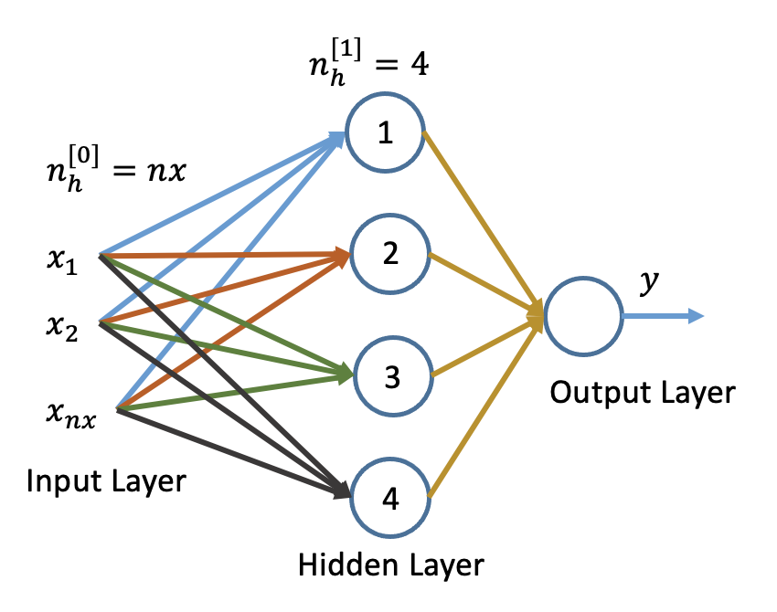
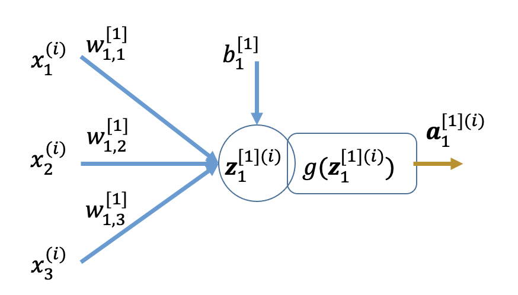

## Cat Classifier using Shallow Neural Network

The network below is called as 2-layer Neural Network (NN). The input layer is not counted by convention to nomenclate the network. The layers between output and input layers are called as hidden layer. In the NN shown below is having one hidden layer and the output layer.

We have developed the basic understanding of the processing happening in the neuron or hidden unit. Each unit is supposed to perform two tasks. First, it represnt the input featues and the weights as linear combination and this computation is called as the linear part of hidden unit computaion. The other part of the computation is the activation using non-linear activation function. This can be represneted in general by the following:  

## Input Dataset as per Matrix Notation

Input Feature vector for $i^{th}$ training example:

$\mathbf{x}^{(i)} = \mathbf{a}^{[0](i)} = \begin{pmatrix} {x}_1^{(i)} \\ {x}_2^{(i)} \\ \vdots \\ {x}_{nx}^{(i)} \end{pmatrix}= \begin{pmatrix} {a}_1^{[0](i)} \\ {a}_2^{[0](i)} \\ \vdots \\ {a}_{nx}^{[0](i)} \end{pmatrix} $   

Input Feature vector of the problem dataset:   

$ \mathbf{X} = \mathbf{A}^{[0]}= \begin{pmatrix} \mathbf{x}^{(1)} & \mathbf{x}^{(2)} & \cdots & \mathbf{x}^{(i)}
\end{pmatrix}$   

$ \mathbf{X} = \mathbf{A}^{[0]} = \begin{pmatrix} {x}_1^{(1)} & {x}_1^{(2)} & \cdots & {x}_1^{(m)} \\ {x}_2^{(1)} & {x}_2^{(2)} & \cdots & {x}_2^{(m)} \\ \vdots & \vdots & \cdots & \vdots \\ {x}_{nx}^{(1)} & {x}_{nx}^{(1)} & \cdots & {x}_{nx}^{(m)} \end{pmatrix}, \mathbf{X} \in \mathbf R ^{nx \times m}$  

**Let the input features be 3 to develop the intuition about the forward and backward propogation.**

## Forward Propagation: $i^{th}$ Training Example

### Hidden Layer-1 Parameters :  

Considering input features as activation of zeroth layer.

**Node-1 of Layer-1**  

$ z^{[1](i)}_1 = w_{11}^{[1]}x^{(i)}_1+w_{12}^{[1]}x^{(i)}_2+w_{13}^{[1]}x^{(i)}_3 + b^{[1]}_1 $   

We can write the above equation in matrix form as   

$z^{[1](i)}_1\ = \begin{pmatrix} w_{11}^{[1]} & w_{12}^{[1]} & w_{13}^{[1]} \end{pmatrix} \begin{pmatrix} x^{(i)}_1 \\ x^{(i)}_2 \\ x^{(i)}_3 \end{pmatrix} + b^{[1]}_1$ 

We know that weights are defined as column vectors where weights for input are stacked vertically for all input features.   

$ \mathbf{w}^{[1]}_1 = \begin{pmatrix} w_{11}^{[1]} \\ w_{12}^{[1]} \\ w_{13}^{[1]} \end{pmatrix} $   

The above matrix form can be written in vecorized for as under:   

$ z^{[1](i)}_1 = \mathbf{w}_1^{[1]T}\mathbf{x}^{(i)} + b^{[1]}_1 $  

This can be implemented using numpy dot() as under using common variables:   

$\mathbf{z}^{[1](i)}_1 = np.dot(\mathbf{w}^{[1]}_1.T, \mathbf{x}^{(i)}) + b^{[1]}_1$   

$ z^{[1](i)}_1 = \mathbf{w}_1^{[1]T}\mathbf{a}^{[0](i)} + b^{[1]}_1 $  

$ a_1^{[1](i)}=g (z^{[1](i)}_1) $

**Node-2 of Layer-1**  

$ z^{[1](i)}_2 = w_{21}^{[1]}x^{(i)}_1+w_{22}^{[1]}x^{(i)}_2+w_{23}^{[1]}x^{(i)}_3 + b^{[1]}_2 $   

We can write the above equation in matrix form as   

$z^{[1](i)}_2\ =\begin{pmatrix} w_{21}^{[1]} & w_{22}^{[1]} & w_{23}^{[1]} \end{pmatrix} \begin{pmatrix} x^{(i)}_1 \\ x^{(i)}_2 \\ x^{(i)}_3 \end{pmatrix} + b^{[1]}_2$  

$ \mathbf{w}^{[1]}_2 = \begin{pmatrix} w_{21}^{[1]} \\ w_{22}^{[1]} \\ w_{23}^{[1]} \end{pmatrix} $  

The above matrix form can be written in vecorized for as under:   

$ z^{[1](i)}_2 = \mathbf{w}_2^{[1]T}\mathbf{x}^{(i)} + b^{[1]}_2 $   

This can be implemented using numpy dot() as under using usual variables:   

$\mathbf{z}^{[1](i)}_2 = np.dot(\mathbf{w}^{[1]}_2.T, \mathbf{x}^{(i)}) + b^{[1]}_2$   

$ z^{[1](i)}_2 = \mathbf{w}_2^{[1]T}\mathbf{a}^{[0](i)} + b^{[1]}_2 $   

$a_2^{[1](i)}=\sigma (z^{[1](i)}_2)$

**Node-3 of Layer-1**  

$ z^{[1](i)}_3 = w_{31}^{[1]}x^{(i)}_1+w_{32}^{[1]}x^{(i)}_2+w_{33}^{[1]}x^{(i)}_3 + b^{[1]}_3 $   

In matrix form,    
$z^{[1](i)}_3\ =\begin{pmatrix} w_{31}^{[1]} & w_{32}^{[1]} & w_{33}^{[1]} \end{pmatrix} \begin{pmatrix} x^{(i)}_1 \\ x^{(i)}_2 \\ x^{(i)}_3 \end{pmatrix} + b^{[1]}_3$  

$ \mathbf{w}^{[1]}_3 = \begin{pmatrix} w_{31}^{[1]} \\ w_{32}^{[1]} \\ w_{33}^{[1]} \end{pmatrix} $.  

The above matrix form can be written in vecorized for as under:   

$ z^{[1](i)}_3 = \mathbf{w}_3^{[1]T}\mathbf{x}^{(i)} + b^{[1]}_3 $  

This can be implemented using numpy dot() as under using common variables:   

$\mathbf{z}^{[1](i)}_3 = np.dot(\mathbf{w}^{[1]}_3.T, \mathbf{x}^{(i)}) + b^{[1]}_3$   

$ z^{[1](i)}_3 = \mathbf{w}_3^{[1]T}\mathbf{a}^{[0](i)} + b^{[1]}_3 $  

$a_3^{[1](i)}=\sigma (z^{[1](i)}_3) $

**Node-4 of Layer-1**    

$ z^{[1](i)}_4 = w_{41}^{[1]}x^{(i)}_1+w_{42}^{[1]}x^{(i)}_2+w_{43}^{[1]}x^{(i)}_3 + b^{[1]}_4 $   

In matrix form,   

$z^{[1](i)}_4\ =\begin{pmatrix} w_{41}^{[1]} & w_{42}^{[1]} & w_{43}^{[1]} \end{pmatrix} \begin{pmatrix} x^{(i)}_1 \\ x^{(i)}_2 \\ x^{(i)}_3 \end{pmatrix} + b^{[1]}_4$  

$ \mathbf{w}^{[1]}_4 = \begin{pmatrix} w_{41}^{[1]} \\ w_{42}^{[1]} \\ w_{43}^{[1]}\end{pmatrix} $   

The above matrix form can be written in vecorized for as under:   

$ z^{[1](i)}_4 = \mathbf{w}_4^{[1]T}\mathbf{x}^{(i)} + b^{[1]}_4 $  

This can be implemented using numpy dot() as under using common variables:   

$\mathbf{z}^{[1](i)}_4 = np.dot(\mathbf{w}^{[1]}_4.T, \mathbf{x}^{(i)}) + b^{[1]}_4$   

$ z^{[1](i)}_4 = \mathbf{w}_4^{[1]T}\mathbf{a}^{[0](i)} + b^{[1]}_4 $  

$a_4^{[1](i)}=\sigma (z^{[1](i)}_4) $

## Linear Computation for Entire Layer

Writting the linear part of the hidden layer to develop the vectorized form.  
$ z^{[1](i)}_1 = w_{11}^{[1]}x^{(i)}_1+w_{12}^{[1]}x^{(i)}_2+w_{13}^{[1]}x^{(i)}_3 + b^{[1]}_1 $   

$ z^{[1](i)}_2 = w_{21}^{[1]}x^{(i)}_1+w_{22}^{[1]}x^{(i)}_2+w_{23}^{[1]}x^{(i)}_3 + b^{[1]}_2 $   

$ z^{[1](i)}_3 = w_{31}^{[1]}x^{(i)}_1+w_{32}^{[1]}x^{(i)}_2+w_{33}^{[1]}x^{(i)}_3 + b^{[1]}_3 $   

$ z^{[1](i)}_4 = w_{41}^{[1]}x^{(i)}_1+w_{42}^{[1]}x^{(i)}_2+w_{43}^{[1]}x^{(i)}_3 + b^{[1]}_4 $  

We can write the above equations in matrix form as below

$\begin{pmatrix} {z}_1^{[1](i)} \\ {z}_2^{[1](i)} \\ z_3^{[1](i)} \\ {z}_{4}^{[1](i)} \end{pmatrix}= \begin{pmatrix} w_{11}^{[1]} & w_{12}^{[1]} & w_{13}^{[1]} \\ w_{21}^{[1]} & w_{22}^{[1]} & w_{23}^{[1]} \\ w_{31}^{[1]} & w_{32}^{[1]} & w_{33}^{[1]} \\ w_{41}^{[1]} & w_{42}^{[1]} & w_{43}^{[1]} \end{pmatrix}\begin{pmatrix} {x}_1^{(i)} \\ {x}_2^{(i)} \\ {x}_{3}^{(i)} \end{pmatrix} + \begin{pmatrix} {b}_1^{[1]} \\ {b}_2^{[1]} \\ b_3^{[1]} \\ {b}_{4}^{[1]} \end{pmatrix}$

Let us define the vectors

$\mathbf{z}^{[1](i)} = \begin{pmatrix} {z}_1^{[1](i)} \\ {z}_2^{[1] (i)} \\ z_3^{[1](i)} \\ {z}_{4}^{[1] (i)} \end{pmatrix}; \mathbf{W}^{[1]} = \begin{pmatrix} w_{11}^{[1]} & w_{12}^{[1]} & w_{13}^{[1]} \\ w_{21}^{[1]} & w_{22}^{[1]} & w_{23}^{[1]} \\ w_{31}^{[1]} & w_{32}^{[1]} & w_{33}^{[1]} \\ w_{41}^{[1]} & w_{42}^{[1]} & w_{43}^{[1]} \end{pmatrix}; \mathbf{x}^{(i)} = \begin{pmatrix} {x}_1^{(i)} \\ {x}_2^{(i)} \\ {x}_{3}^{(i)} \end{pmatrix}; \mathbf{b}^{[1]} = \begin{pmatrix} {b}_1^{[1]} \\ {b}_2^{[1]} \\ b_3^{[1]} \\ {b}_{4}^{[1]} \end{pmatrix}$  

$\mathbf W^{[1]}.\text shape()=(n_h, n_{h-1})$

The vectorized equation can be written as:  

$\mathbf{z}^{[1] (i)} = \mathbf{W}^{[1]}\mathbf{x}^{(i)} + \mathbf{b}^{[1]}$   

This can be implemented using numpy dot() as under using common variables:   

$\mathbf{z}^{[1] (i)} = np.dot(\mathbf{W}^{[1]}, \mathbf{x}^{(i)}) + \mathbf{b}^{[1]}$   

The output of the linear part is then activated by a suitable activation function.

The above vectorised equation can also be developed by considering the output of the linear part in vector form.   

$ z^{[1] (i)}_1 = \mathbf{w}_1^{[1]T}\mathbf{x}^{(i)} + b^{[1]}_1 $.  

$ z^{[1] (i)}_2 = \mathbf{w}_2^{[1]T}\mathbf{x}^{(i)} + b^{[1]}_2 $  

$ z^{[1] (i)}_3 = \mathbf{w}_3^{[1]T}\mathbf{x}^{(i)} + b^{[1]}_3 $  

$ z^{[1] (i)}_4 = \mathbf{w}_4^{[1]T}\mathbf{x}^{(i)} + b^{[1]}_4 $  

We can write the above set of equations in matrix form as under:  

$ \mathbf{z}^{[1] (i)} = \begin{pmatrix} {z}_1^{[1] (i)} \\ {z}_2^{[1] (i)} \\ z_3^{[1] (i)} \\ {z}_{4}^{[1] (i)} \end{pmatrix} = \begin{pmatrix} \mathbf{w}_1^{[1]T} \mathbf x^{(i)} \\ \mathbf{w}_2^{[1]T}\mathbf x^{(i)} \\ \mathbf{w}_3^{[1]T}\mathbf x^{(i)} \\ \mathbf{w}_4^{[1]T}\mathbf x^{(i)} \end{pmatrix} + \begin{pmatrix} b_1 \\ b_2 \\ b_3 \\ b_4 \end{pmatrix} $ 

The vectorized form is written as below    

  $\mathbf{z}^{[1](i)} = \mathbf{W}^{[1]}\mathbf{x}^{(i)} + \mathbf{b}^{[1]}$

This is the same as that of expression derived earlier.

$\mathbf{W}^{[1]} = \begin{pmatrix} \mathbf{w}_1^{[1]T} \\ \mathbf{w}_2^{[1]T} \\ \mathbf{w}_3^{[1]T} \\ \mathbf{w}_{4}^{[1]T}\end{pmatrix} $

### Activation Function
We use $sigmoid()$ activation function when we need to calculate probability and the output is converted into 0 and 1 with the use of some threshold value.   

We use $tanh()$ function for the hidden layer as it maps negative values with negative and zero with zero. The output of the $tanh()$ function ranges between $-1$ to $+1$. The shape of $tanh()$ is also s-shaped as the shape of $sigmoid()$ activation is but it is shfted to map 0 with 0.    
$\mathbf{a}^{[1](i)} = tanh(\mathbf{z}^{[1](i)})$.   

The $tanh(z)$ is given by $tanh(z)=\large \frac{e^{z}-e^{-z}}{e^{z}+e^{-z}}$.  

$\large \frac{\partial[tanh(z)]}{\partial z}=\small 1-[tanh(z)]^2$.  

The above vectorized form of the equations are to be used for python implementation of the forward propagation of first hidden layer. We can represnt the input feature vector as the activation output of zeroth layer.

## Second Layer: Output Layer

### Layer-2  Node-1

$ z^{[2] (i)} = w_{11}^{[2]}a^{[1] (i)}_1+w_{12}^{[2]}a^{[1] (i)}_2+w_{13}^{[2]}a^{[1] (i)}_3 + w_{14}^{[2]}a^{[1] (i)}_4 + b^{[2]}_1 $   

$ z^{[2] (i)} = \mathbf{w}^{[2]T}\mathbf{a}^{[1] (i)} + b^{[2]} $  

$a^{[2] (i)}=\sigma (z^{[2] (i)}) $

$\mathbf{z}^{[2] (i)} = \mathbf{w}^{[2]T} \mathbf{a}^{[1] (i)} + \mathbf{b}^{[2]}$.   

Note that $\mathbf w^{[2]}.shape=(4,1)$ but $W.shape=(n^{[l]}, n^{[l-1]})$. So, $W^{[2]}.shape=(1,4)$, this gives $W^{[2]}=\mathbf w^{[2]T}$  

$\mathbf{z}^{[2] (i)} = \mathbf{W}^{[2]} \mathbf{a}^{[1] (i)} + \mathbf{b}^{[2]}$.   

This can be implemented using numpy dot() as under using common variables:   

$\mathbf{z}^{[2] (i)} = np.dot(\mathbf{W}^{[2]}, \mathbf{a}^{[1] (i)}) + b^{[2]}$   

We will use $sigmoid()$ activation function for the output layer as we need the binary classification on the basis of the probability of output being true for give data.  

$\mathbf{a}^{[2] (i)} = sigmoid(\mathbf{z}^{[2] (i)})$.

The above vectorized form of the equations are to be used for python implementation of the forward propagation of output layer.

## Forward Propagation : One Training Example

Let us re-write the set of four vectorized equations developed above for hidden layer and output layer by the dropping `(i)` to represent single training example as:  

**Hidden Layer**  

$\mathbf{z}^{[1]} = \mathbf{W}^{[1]} \mathbf{a}^{[0]} + \mathbf{b}^{[1]}$   

$\mathbf{a}^{[1]} = tanh(\mathbf{z}^{[1]})$   

**Output Layer**  

$\mathbf{z}^{[2]} = \mathbf{W}^{[2]} \mathbf{a}^{[1]} + \mathbf{b}^{[2]}$   

$\mathbf{a}^{[2]} = sigmoid(\mathbf{z}^{[2]})$   

These four vectorized equations, two for each layer are to be used for python implementation.

## Backward Propagation to Compute Gradients: One Training Example

The forward propagation starts with assumed values of the parameters. The parameters in the example of 2-Layer with 3 input features and 4 nodes in the hidden layer for the binary classification problem are $\mathbf W^{[1]}, \mathbf W^{[2]}, \mathbf b^{[1]}, b^{[2]}$.   

$ \mathbf W^{[1]}.shape=(4, 3)$  

$ \mathbf W^{[2]}.shape=(1, 4)$  

$ \mathbf b^{[1]}.shape=(4, 1)$  

$ \mathbf b^{[2]}.shape=(1, 1)$  

So, in all we have to optimize the 21 parameters for this network using the training data. For the purpose of explaining the method, we have assumed only one training example.   

### Loss Function  

We first need to calculate the loss. The loss function is assumed as:   

$L(a, y) =  - y  \log(a^{[2]}) - (1-y)  \log(1-a^{[2]})$   

The loss is to be minimized using garient descent optimization method. In this, we evaluate the gradient of the function and update the parameter till we reach the global minima. Following general update rules are applied:   

$ \mathbf w = \mathbf w - \alpha \frac {\partial L}{\partial \mathbf w}$  

$ \mathbf b = \mathbf b - \alpha \frac {\partial L}{\partial \mathbf b}$  

Where,  
        $ \alpha$ : Learning Rate (0.0001, 0.001, 0.01...)

## Calculating Gradients for Output Layer

The parameters of output layer are $w_{11}^{[2]}, w_{12}^{[2]}, w_{13}^{[2]}, w_{14}^{[2]}, b^{[2]}$. The gradients are computed in the same manner as derived in case of logistic regression as the **sigmoid function** is the activation function on output layer.     

$\large \frac{\partial L}{\partial w_{11}^{[2]}}= \frac{\partial L}{\partial a^{[2]}} \frac{\partial a^{[2]}}{\partial z^{[2]}}  \frac{\partial z^{[2]}}{\partial w_{11}^{[2]}}=\frac{\partial L}{\partial z^{[2]}}\small a^{[1]}_1=(a^{[2]}-y)a^{[1]}_1$

$\large \frac{\partial L}{\partial w_{12}^{[2]}}= \frac{\partial L}{\partial a^{[2]}} \frac{\partial a^{[2]}}{\partial z^{[2]}}  \frac{\partial z^{[2]}}{\partial w_{12}^{[2]}}=\frac{\partial L}{\partial z^{[2]}}\small a^{[1]}_2=(a^{[2]}-y)a^{[1]}_2$

$\large \frac{\partial L}{\partial w_{13}^{[2]}}= \frac{\partial L}{\partial a^{[2]}} \frac{\partial a^{[2]}}{\partial z^{[2]}}  \frac{\partial z^{[2]}}{\partial w_{13}^{[2]}}=\frac{\partial L}{\partial z^{[2]}}\small a^{[1]}_3=(a^{[2]}-y)a^{[1]}_3$

$\large \frac{\partial L}{\partial w_{14}^{[2]}}= \frac{\partial L}{\partial a^{[2]}} \frac{\partial a^{[2]}}{\partial z^{[2]}}  \frac{\partial z^{[2]}}{\partial w_{14}^{[2]}}=\frac{\partial L}{\partial z^{[2]}}\small a^{[1]}_4=(a^{[2]}-y)a^{[1]}_4$

$\large \frac{\partial L}{\partial b^{[2]}}= \frac{\partial L}{\partial a^{[2]}} \frac{\partial a^{[2]}}{\partial z^{[2]}}  \frac{\partial z^{[2]}}{\partial b^{[2]}}=\frac{\partial L}{\partial z^{[2]}}\small=(a^{[2]}-y)$

