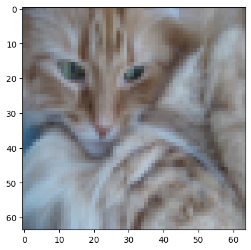
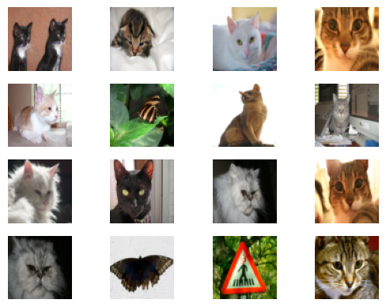
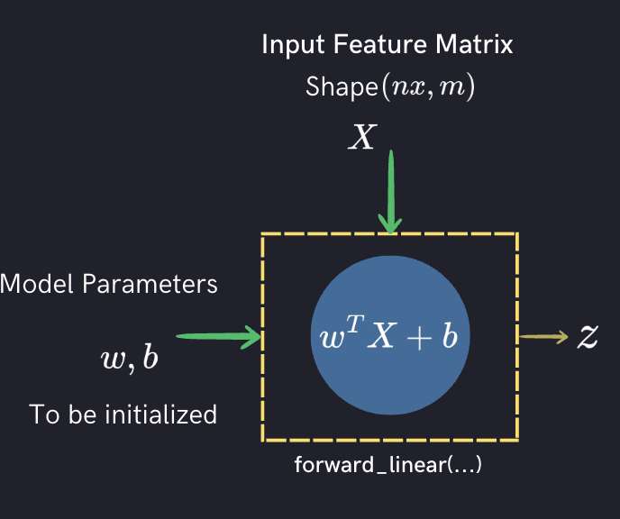
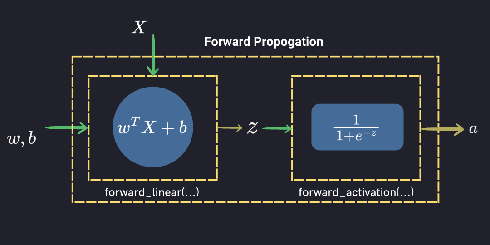
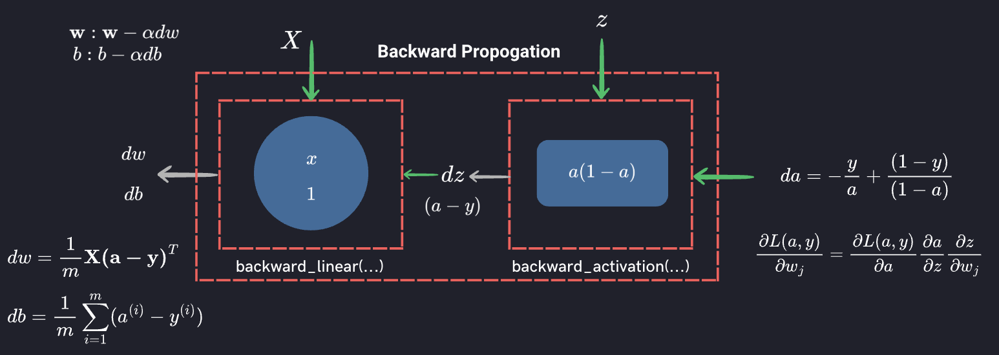
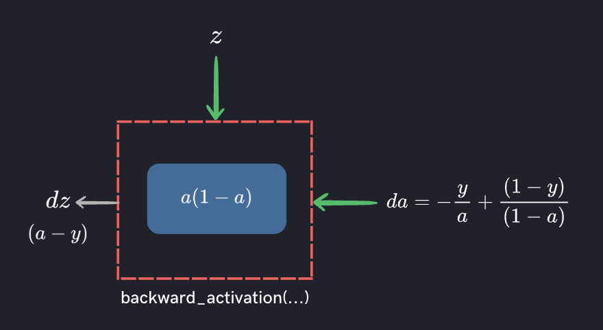
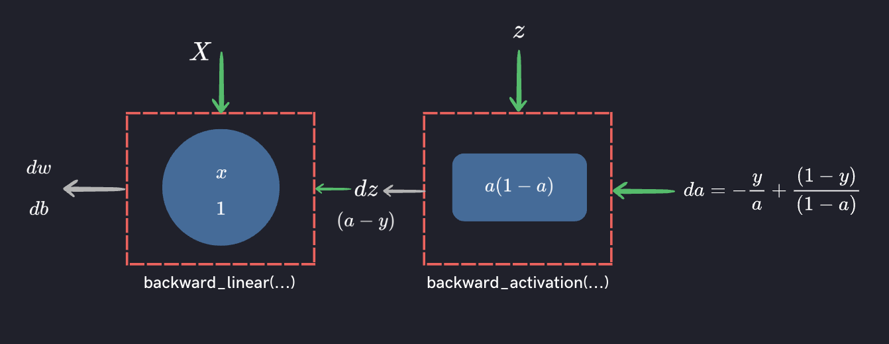
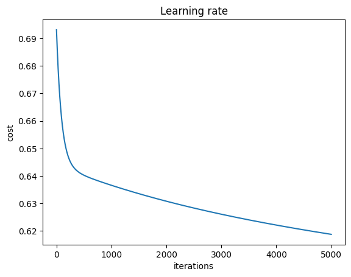

## Binary Classification using Logistic Rgression - Dataset

- Open a New Notebook on Google Colab or you can clone a 

```
git clone https://github.com/vkjadon/deep_learning/
```

Use dl_01_lr_single_neuron.ipynb

Clone the following github repository and follow along. 

```py
# Cleaning up variables to prevent loading data multiple times (which may cause memory issue)
try:
  for var in dir():
    if not var.startswith("_"):
      del var
      print(f'Clearing {var}.')
except:
  pass
! git clone https://github.com/vkjadon/utils/
```
Run the cell to import necessary modules

```js
import numpy as np
import h5py
import matplotlib.pyplot as plt
from utils.public_tests import *
```
### Fetch Dataset from Kaggle
- Import data from Kaggle
- Use <a href="https://www.kaggle.com/muhammeddalkran/catvnoncat" target="_blank"> this Link </a>  

From the download button, copy the following code and execute to download the data.

```js
import kagglehub

# Download latest version
path = kagglehub.dataset_download("muhammeddalkran/catvnoncat")

print("Path to dataset files:", path)
```
Check the list of the path

```bash
!ls /kaggle/input/catvnoncat
```
> catvnocat
It shows one folder with name `catvnocat`

```bash
!ls /kaggle/input/catvnoncat/catnocat
```
> test_catvnoncat.h5  train_catvnoncat.h5

These are `h5` files. Check documentation for more details. [Documentationt](https://docs.h5py.org/en/stable/)


 `h5py.File` acts like a Python dictionary, thus we can check the keys using `key()` method with list or `for loop`. [h5py Documentation Link](https://docs.h5py.org/en/stable/quick.html)
 
 ```js
print(f'List containing keys only {list(train_dataset.keys())}')
```

Key values are the `Groups` like a folder in file system.The groups contain dataset as files in the folders. 

```js
for key in train_dataset.keys():
    print(train_dataset[key], type(train_dataset[key]))
```

 ## Load Dataset

```js
train_dataset = h5py.File( path + '/catvnoncat/train_catvnoncat.h5', "r")
```

The, <class 'h5py._hl.dataset.Dataset'> is not the data itself, but a handle (object) pointing to the dataset inside the HDF5 file. 

```js
print(type(train_dataset["train_set_y"]))
list(train_dataset["train_set_y"])
```

The list looks like a Numpy array, but it is not. To actually use the values, you typically convert it into a NumPy array.

```js
a=np.array(train_dataset["list_classes"])
print(a, a.dtype)
```

In NumPy, the `|S7` data type represents a fixed-length string of 7 characters. The S stands for string, and the number 7 indicates the length of the string. This data type is useful when you want to store and manipulate fixed-length strings in a NumPy array. Each element of the array will be a string of exactly 7 characters.

If you want to store a string of 4 characters in a NumPy array with the |S7 data type, you can do so by using a fixed-length string of length 7, where the remaining 3 characters are filled with spaces.

## Exploring Data

```js
train_set_x_orig = np.array(train_dataset["train_set_x"]) # your train set features
train_set_y_orig = np.array(train_dataset["train_set_y"]) # your train set labels
```

You can use standard functions to explore data. You may find the shape of the feature matrix (`train_set_x_orig`) is **(209, 64, 64, 3)** and the shape of output label matrix (`train_set_y_orig`) is **(209,)**.

## Show cat image - MatPlotLib

```js
index = 2
plt.imshow(train_set_x_orig[index])
```


Change the index to show other images. You can also show the images in a grid

```js
for i in range(16):
  plt.subplot(4, 4, i+1)
  plt.imshow(test_set_x_orig[i])
  plt.axis('off')
```
This will show 16 images in 4 x 4 grid. In the `subplot` function:

- First index is for rows
- Second is for columns
- Last index is for image number




## Setting Data as per Matrix Notation
Our formulation takes all features in a single column and the training examples in different columns. This makes a matrix of size number of features and number of training examples. 

So, the shape of $X$ matrix is $(nx, m)$, where,   

$nx = px \times py \times 3 $ for the images as input and $m$ is the training examples.

```js
num_px = train_set_x_orig.shape[1]
num_py = train_set_x_orig.shape[2]
nx = num_px * num_py * 3
m_train = train_set_x_orig.shape[0]

print (f"Number of Features  = {nx}")
print (f"Number of training examples = {m_train}")
print (f"Size of image in pixels: {num_px} x {num_py}")
# You should get nx = 12288 and m_train = 209
```

You should reshape `train_set_x_orig` to `(nx,m_train)` and `train_set_y_orig` to `(1, m_train)` if they are not as per our convention.

```js
train_set_x=train_set_x_orig.reshape(-1, m_train)
train_set_y = train_set_y_orig.reshape((1, m_train))
```

To represent color images, the red, green and blue channels (RGB) must be specified for each pixel, and so the pixel value is actually a vector of three numbers ranging from 0 to 255.

Optimizing the parameters is best suited on the data of the same range. Let's normalize our dataset with the maximum possible pixel value i.e. 255.

```js
X_train = train_set_x / 255.
y_train=train_set_y
```

Check the input data using the following test.

```js
input_data_test(X_train, y_train, m_train, nx)
```

## Forward Propogation

Before going into the details of forward prpogation, we have to first initialize the weights and biases. 

```py
def initialize_with_zeros(features):
    """
    This function creates a vector of zeros of shape (features, 1) for w and initializes b to 0.

    Argument:
    features -- size of the w vector we want (or number of parameters in this case)

    Returns:
    w -- initialized vector of shape (features, 1)
    b -- initialized scalar (corresponds to the bias) of type float
    """

    w = np.zeros(features).reshape(features,1)
    b = 0.0

    return w, b
```

Check with the following test

```py
initialize_with_zeros_test(initialize_with_zeros)
```

Compute the initial weights and biases. These will be used for testing other functions where the output of this function will be the input to other subsequent functions.

```js
w, b = initialize_with_zeros(nx)
```
Now, we can implement the linear computation using the following vectorized equation.

$\mathbf{z} = \mathbf{w}^T \mathbf{X} + b$  

<div style="background-color:#20212b ; width: 100%; text-align: center;">
  
</div>

```py
def forward_linear(X, w, b):
  """
    Compute the linear output z

    Arguments:
    x -- A 2D numpy array of size (nx, m)
    w -- A 2D numpy array of size (nx, 1)
    b -- A scalar

    Return:
    z -- wx + b of size (1, m)
  """
  z = np.dot(w.T, X) + b

  return z
```

Check with the following test:

```js
forward_linear_test(forward_linear)
```
Compute the linear output using the `forward_linear` function.

These will be used for testing other functions where the output of this function will be the input to other subsequent functions.

```js
z = forward_linear(X_train, w, b)
```


Now, you can add the non-linearity using a non linear activation function. Sigmoid is best suited at output layer for a binary classification problem such as `cat` and `no-cat`. 

Following is the vectorized form for activated output:

$$\mathbf {\hat{y}} = \mathbf {a} = \frac {1}{1+e^{-\mathbf {z}}} $$

<div style="background-color:#20212b ; width: 100%; text-align: center;">
  
</div>

The following function implement `sigmoid` activation.

```js
def forward_activation(z):
    """
    Compute the activated output of z (sigmoid in this case)

    Arguments:
    z -- A 2D numpy array of any size [(1, m) in this case].

    Return:
    s -- sigmoid(z) of any size [(1, m) in this case].
    """

    s = 1/(1+np.exp(-z))

    return s
```
Check with the following test and once all the test cases passed compute activated output:

```js
forward_activation_test(forward_activation)
```
Compute the activated output

```js
A = forward_activation(z)
```

These will be used for testing other functions where the output of this function will be the input to other subsequent functions.

Compute Cost

$$J = -\frac{1}{m}\sum_{i=1}^{m}(y^{(i)}\log(a^{(i)})+(1-y^{(i)})\log(1-a^{(i)}))$$

Vectorize form

$$J = -\frac{1}{m}\sum(\mathbf y\log(\mathbf a)+(1-\mathbf y)\log(1- \mathbf a))$$

The sum is be carried out along `axis = 1` to finally get scalar value of cost.

```js
def compute_cost(A, y_train):
  """
    Compute the cost based on the Binary Cross Entropy Loss

    Arguments:
    A -- A 2D numpy array of any size [(1, m) in this case].
    y_train -- A 2D numpy array of any size [(1, m) in this case].

    Return:
    cost -- scalar of float type.
    """

    cost = -np.sum((y_train*np.log(A)+(1-y_train)*np.log(1-A)),axis=1)
    cost = np.squeeze(cost)

  return cost
```

Check the function 

```js
compute_cost_test(compute_cost)
```
Compute the cost in one iteration. 

```js
cost = compute_cost(A, y_train)
```
This is not as such required for training but is used to monitor the progress of the training. It is used in plotting the learning curve.



Compute the gradients ($dw, db$) to complete the one step of training. This is the back propogation step.

The gradient of output layer loss with respect to the output activation for cross entropy loss is given by

$L(\mathbf{a}, \mathbf{y}) =  - \mathbf{y}  \log(\mathbf{a}) - (1-\mathbf{y})  \log(1-\mathbf{a})$  

The vectorized form of the gradient ($dL/da$) is 

$da= - \frac{\mathbf{y}}{\mathbf{a}} - \frac{1-\mathbf{y}}{1-\mathbf{a}}$

```js
da = - (np.divide(y_train, A) - np.divide(1 - y_train, 1 - A))
```

<div style="background-color:#20212b ; width: 100%; text-align: center;">
  
</div>

Using

$$y= \frac{u(x)}{v(x)}; \frac{\partial y} {\partial x}=\frac {vu'-uv'}{v^2}$$ 

We evaluate

$ \frac{\partial a}{\partial z}=\frac{\partial }{\partial z} (\frac {1}{1+e^{-z}}) = \frac {e^{-z}}{(1+e^{-z})^2}=\frac {1}{1+e^{-z}}\frac {1+e^{-z}-1}{1+e^{-z}} =a(\frac {1+e^{-z}}{1+e^{-z}} - \frac {1}{1+e^{-z}})$

The vectorized form

$ \frac{\partial \mathbf a}{\partial \mathbf z}=\mathbf a(1- \mathbf a)$

```py
def backward_activation(z, da):
  """
    Compute the (dJ/dz)

    Arguments:

    z -- A 2D numpy array of any size [(1, m) in this case].
    da -- (dL/da) Gradient of loss wrt activated output.

    Return:
    dz -- scalar of float type.
  """

  s = 1/(1+np.exp(-z))

  ds_da = s * (1 - s)

  dz = da * ds_da

  return dz
```

Compute $ \partial J/\partial z$

```py
dz = backward_activation(z, da)
```

<div style="background-color:#20212b ; width: 100%; text-align: center;">
  
</div>


In vectorized form,  

$$ \frac{\partial J}{\partial \mathbf{w}} = \frac{1}{m}\mathbf {X(a-y)}^T = \frac{1}{m}\mathbf {X(dz)}^T $$

$$ \frac{\partial J}{\partial b} = \frac{1}{m} \sum_{i=1}^m (a^{(i)}-y^{(i)}) = \frac{1}{m} \sum_{i=1}^m (dz^{(i)})$$

```py
def backward_linear(X, dz):
  """
    Compute the (dJ/dw, dJ/db)

    Arguments:

    x -- A 2D numpy array of size (nx, m)
    dz -- (dJ/dz) Gradient of cost wrt linear output.

    Return:
    dw, db -- scalar of float type.
  """

  m = X.shape[1]

  dw = np.dot(X, dz.T)/m

  db = np.sum((dz), dtype=np.float64, axis=1)/m

  return dw, db
```

Check the function using the following

```js
backward_prop_test(backward_prop)
```
```py
dw, db = backward_linear(X_train, dz)
```

You can now update the parameters. Write a function to implement the update equation.

```js
def update_parameters(w, b, dw, db, m_train, learning_rate = 0.002):
  w = w - learning_rate * dw / m_train
  b = b - learning_rate * db / m_train
  return w, b
```

Now, its the time when you can arrange each of these steps to complete our logistic regtression model for binary classification using single neuron. This is basically exactly the same code we have developed in the last session where entire mathematical computation was explained.

```js
max_iteration=5000
cost=np.zeros((max_iteration))

w, b = initialize_with_zeros(nx)

for i in range(max_iteration):

  z = forward_linear(X_train, w, b)

  A = forward_activation(z)

  cost[i] = compute_cost(A, y_train)/m_train

  dw, db = backward_prop(X_train, A, y_train)

  w, b = update_parameters(w, b, dw, db, m_train, learning_rate = 0.002)

# print(w, b)
```
This will give us optimum parameters. We have also computed the cost in each iteration. So, you can also plot the learning curve.

```js
plt.plot(cost)
plt.ylabel('cost')
plt.xlabel('iterations')
plt.title("Learning rate")
plt.show()
```


## Train Accuracy

```js
A_pred = forward_activation(forward_linear(X_train, w, b))

y_pred = np.array([1 if pred > 0.5 else 0 for pred in A_pred[0]]).reshape(1, m_train)

print((np.sum(y_pred == y_train))/m_train)
```
> 0.6555023923444976

## Test Accuracy

```js
test_dataset = h5py.File(f'{path}/catvnoncat/test_catvnoncat.h5', "r")
test_set_x_orig = np.array(test_dataset["test_set_x"])
test_set_y = np.array(test_dataset["test_set_y"])
m_test= test_set_x_orig.shape[0]
test_set_x=test_set_x_orig.reshape(-1, m_test)
X_test = test_set_x / 255.
y_test=test_set_y
```

```js
A_pred = forward_activation(forward_linear(X_test, w, b))

y_pred = np.array([1 if pred > 0.5 else 0 for pred in A_pred[0]]).reshape(1, m_test)

print((np.sum(y_pred == y_test))/m_test)
```
> 0.34

This is the case of underfitting as the training accuracy is low because the model is too simple and the learning hasn’t converged. Test accuracy is much worse than training accuracy, which indicates poor generalization. It is not generalizing the learning on the test dataset.

## Cat Classifier Using `SKLearn`
