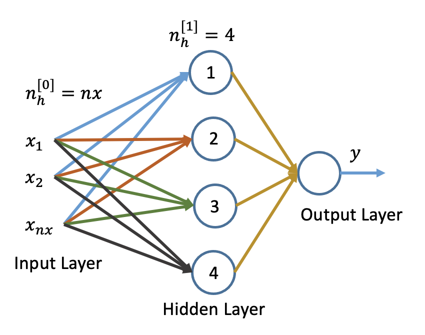
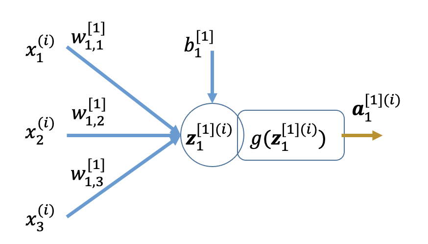

## Cat Classifier using Shallow Neural Network

The network below is called as 2-layer Neural Network (NN). The input layer is not counted by convention to nomenclate the network. The layers between output and input layers are called as hidden layer. In the NN shown below is having one hidden layer and the output layer.



We have developed the basic understanding of the processing happening in the neuron or hidden unit. Each unit is supposed to perform two tasks. First, it represnt the input featues and the weights as linear combination and this computation is called as the linear part of hidden unit computaion. The other part of the computation is the activation using non-linear activation function. This can be represneted in general by the following:  

## Input Dataset as per Matrix Notation

Input Feature vector for $i^{th}$ training example:

$\mathbf{x}^{(i)} = \mathbf{a}^{[0](i)} = \begin{pmatrix} {x}_1^{(i)} \\ {x}_2^{(i)} \\ \vdots \\ {x}_{nx}^{(i)} \end{pmatrix}= \begin{pmatrix} {a}_1^{[0](i)} \\ {a}_2^{[0](i)} \\ \vdots \\ {a}_{nx}^{[0](i)} \end{pmatrix} $   

Input Feature vector of the problem dataset:   

$ \mathbf{X} = \mathbf{A}^{[0]}= \begin{pmatrix} \mathbf{x}^{(1)} & \mathbf{x}^{(2)} & \cdots & \mathbf{x}^{(i)}
\end{pmatrix}$   

$ \mathbf{X} = \mathbf{A}^{[0]} = \begin{pmatrix} {x}_1^{(1)} & {x}_1^{(2)} & \cdots & {x}_1^{(m)} \\ {x}_2^{(1)} & {x}_2^{(2)} & \cdots & {x}_2^{(m)} \\ \vdots & \vdots & \cdots & \vdots \\ {x}_{nx}^{(1)} & {x}_{nx}^{(1)} & \cdots & {x}_{nx}^{(m)} \end{pmatrix}, \mathbf{X} \in \mathbf R ^{nx \times m}$  

**Let the input features be 3 to develop the intuition about the forward and backward propogation.**

```py
! git clone https://github.com/vkjadon/utils/
```
```js
import numpy as np
import h5py
import matplotlib.pyplot as plt
from utils.public_tests import *
```
## Fetch Dataset from Kaggle
- Import data from Kaggle
- Use <a href="https://www.kaggle.com/muhammeddalkran/catvnoncat" target="_blank"> this Link </a>  

From the download button, copy the following code and execute to download the data.

```js
import kagglehub

# Download latest version
path = kagglehub.dataset_download("muhammeddalkran/catvnoncat")

print("Path to dataset files:", path)
```

## Load Dataset

```js
train_dataset = h5py.File( path + '/catvnoncat/train_catvnoncat.h5', "r")
train_set_x_orig = np.array(train_dataset["train_set_x"]) # your train set features
train_set_y_orig = np.array(train_dataset["train_set_y"]) # your train set labels

num_px = train_set_x_orig.shape[1]
num_py = train_set_x_orig.shape[2]
nx = num_px * num_py * 3
m_train = train_set_x_orig.shape[0]

train_set_x=train_set_x_orig.reshape(m_train, -1).T
train_set_y = train_set_y_orig.reshape((1, m_train))

X_train = train_set_x / 255.
y_train=train_set_y

nx, m_train = X.shape

```

## Forward Linear Computation : Layer - 1

**Node-1 :** $[z^{[1](i)}_1]$  



$ z^{[1](i)}_1 = w_{11}^{[1]}x^{(i)}_1+w_{12}^{[1]}x^{(i)}_2+ \cdots w_{1nx}^{[1]}x^{(i)}_{nx} + b^{[1]}_1 $   

**Node-2 :** $[z^{[1](i)}_2]$  

$ z^{[1](i)}_2 = w_{21}^{[1]}x^{(i)}_1+w_{22}^{[1]}x^{(i)}_2+ \cdots w_{2 nx}^{[1]}x^{(i)}_{nx} + b^{[1]}_2 $   

**Node-3 :** $[z^{[1](i)}_3]$  

$ z^{[1](i)}_3 = w_{31}^{[1]}x^{(i)}_1+w_{32}^{[1]}x^{(i)}_2+ \cdots w_{3 nx}^{[1]}x^{(i)}_{nx} + b^{[1]}_3 $   

**Node-4 :** $[z^{[1](i)}_4]$  

$ z^{[1](i)}_4 = w_{41}^{[1]}x^{(i)}_1+w_{42}^{[1]}x^{(i)}_2+ \cdots w_{4nx}^{[1]}x^{(i)}_{nx} + b^{[1]}_4 $  


We can write the above equations in matrix form as below

$\begin{pmatrix} {z}_1 \\ {z}_2 \\ z_3 \\ {z}_{4}\end{pmatrix}^{[1](i)}= \begin{pmatrix} w_{11} & w_{12} & \cdots & w_{1 nx} \\ w_{21} & w_{22} & \cdots & w_{2 nx} \\ w_{31} & w_{32} & \cdots & w_{3 nx} \\ w_{41} & w_{42} & \cdots & w_{4 nx}\end{pmatrix}^{[1]} \begin{pmatrix} x_1 \\ x_2 \\ \vdots x_{nx} \end{pmatrix}^{(i)} + \begin{pmatrix} b_1 \\ b_2 \\ b_3 \\ b_{4} \end{pmatrix}^{[1]}$

The superscripts $[1]$ and $(i)$ for the layer and the training example are taken out and placed as superscript on the parenthesis to represent that it is applicatble to all the elements of the array/matrix.

Let us define the vectors

$\mathbf{z}^{[1](i)} = \begin{pmatrix} z_1 \\ z_2 \\ z_3 \\ z_4 \end{pmatrix}^{[1] (i)}$

$\mathbf{W}^{[1]} = \begin{pmatrix} w_{11} & w_{12} & \cdots & w_{1 nx} \\ w_{21} & w_{22} & \cdots & w_{2 nx} \\ w_{31} & w_{32} & \cdots & w_{3 nx} \\ w_{41} & w_{42} & \cdots & w_{4 nx}\end{pmatrix}^{[1]}$

$\mathbf{x}^{(i)} = \begin{pmatrix} x_1 \\ x_2 \\ \vdots \\ x_{nx} \end{pmatrix}^{(i)}$

and

$\mathbf{b}^{[1]} = \begin{pmatrix} b_1 \\ b_2 \\ b_3 \\ b_4 \end{pmatrix}^{[1]}$

We can consider input features as activation of zeroth layer.

$\mathbf{x}^{(i)} = \mathbf{a}^{[0](i)} = \begin{pmatrix} a_1 \\ a_2 \\ \vdots \\ a_{nx} \end{pmatrix}^{[0](i)}$

$\mathbf W^{[1]}.\text shape()=(n_L, n_{L-1})$
<div style="position: relative; width: 100%; height: 0; padding-top: 56.2500%;
 padding-bottom: 0; box-shadow: 0 2px 8px 0 rgba(63,69,81,0.16); margin-top: 1.6em; margin-bottom: 0.9em; overflow: hidden;
 border-radius: 8px; will-change: transform;">
  <iframe loading="lazy" style="position: absolute; width: 100%; height: 100%; top: 0; left: 0; border: none; padding: 0;margin: 0;"
    src="https://www.canva.com/design/DAGy2kevHeY/bgd9XqOJipQFsKy0_hhq4g/view?embed" allowfullscreen="allowfullscreen" allow="fullscreen">
  </iframe>
</div>

<a href="https:&#x2F;&#x2F;www.canva.com&#x2F;design&#x2F;DAGy2kevHeY&#x2F;bgd9XqOJipQFsKy0_hhq4g&#x2F;view?utm_content=DAGy2kevHeY&amp;utm_campaign=designshare&amp;utm_medium=embeds&amp;utm_source=link" target="_blank" rel="noopener">04-2L-Logistic Regression</a>


Let us define our network first with number of neurons in each layer.

```js
network_layers = [nx, 4, 1]
```  

You are aware to begin the computation, you need to initialize the trainable parameters. The following function will take the `network_layes` as input to initialize the parameters of hidden and output layers. 

```js
def initialize_parameters_2L(output_size, input_size, layer):
  """
    This function creates a vector of zeros of shape (features, 1) for w and initializes b to 0.

    Argument:
    features -- size of the w vector we want (or number of parameters in this case)

    Returns:
    w -- initialized vector of shape (features, 1)
    b -- initialized scalar (corresponds to the bias) of type float
    """

  random_state = 2
  rng = np.random.default_rng(random_state)

  W_matrix = rng.standard_normal((output_size, input_size)) * 0.01
  b_array = np.zeros((output_size, 1))

  Weight  = "W" + str(layer)
  bias  = "b" + str(layer)

  param = { Weight : W_matrix, bias : b_array }

  return param
```
Now, you can use the above function to initialize the parameters for each layer for the assumed model. We are considering 2-Layer neural network with 4 neuron in hidden layer.   

```js
network_model = [nx, 4, 1]
```

Initialize the trainable parameters

```js
parameters = {}

params = initialize_parameters_2L(network_model[1], network_model[0], 1)
parameters["W1"] = params["W1"]
parameters["b1"] = params["b1"]

params = initialize_parameters_2L(network_model[2], network_model[1], 2)
parameters["W2"] = params["W2"]
parameters["b2"] = params["b2"]

print(parameters["W2"], parameters["b2"])
```

You can further make this function concise by unpacking the values in the desired keys. This approach may further simplify the function as well, but, we are not dealing it here.

```js
parameters = {}

parameters["W1"], parameters["b1"] = initialize_parameters_2L(network_model[1], network_model[0], 1).values()
parameters["W2"], parameters["b2"] = initialize_parameters_2L(network_model[2], network_model[1], 2).values()
print(parameters["W2"], parameters["b2"])
```

The vectorized equation of the forward linear coputation can be written as:  

$\mathbf{z}^{[1] (i)} = \mathbf{W}^{[1]}\mathbf{x}^{(i)} + \mathbf{b}^{[1]}$ 

### $m$ training examples

When we consider $m$ training examples, we have to stack the data horizontally for each training examples. The size of the weight and bias matrix/vector are not affected by training examples. The $\mathbf {z, a}$ and $\mathbf x $ would be replaced with $\mathbf {Z, A}$ and $\mathbf X $ by stacking training examples horizontally. It may be noted that input feature matrix $\mathbf X$ can be written as $\mathbf A^{[0]}$.    

The concept of stacking training examples horizontally is used below to convert the equations developed for forward and backward propagation steps earlier, into the equations to handle $m$ training examples.

$ \mathbf{Z}^{[1]} = \begin{pmatrix} z^{(1)}_1 & z^{(2)}_1 & \cdots & z^{(m)}_1\\ z^{(1)}_2 & z^{(2)}_2 & \cdots & z^{(m)}_2\\ z^{(1)}_3 & z^{(2)}_3 & \cdots & z^{(m)}_3\\ z^{(1)}_4 & z^{(2)}_4 & \cdots & z^{(m)}_4 \end{pmatrix}^{[1]}$.  

$ \mathbf{Z}^{[1]} = \begin{pmatrix}
\mathbf{z}^{(1)} & \mathbf{z}^{(2)} & \cdots & \mathbf{z}^{(m)}
\end{pmatrix}^{[1]}$

$\mathbf{Z}^{[1]} = \begin{pmatrix} \mathbf{W}^{[1]} \mathbf{a}^{[0](1)} + \mathbf{b}^{[1]} & \mathbf{W}^{[1]} \mathbf{a}^{[0](2)} + \mathbf{b}^{[1]} & \cdots & \mathbf{W}^{[1]} \mathbf{a}^{[0](m)} + \mathbf{b}^{[1]} \end{pmatrix}$

$ \mathbf{Z}^{[1]} = \mathbf{W}^{[1]} \mathbf{A^{[0]}} + \mathbf{b}^{[1]}$

## Forward Linear Computation : Layer - 2

The layer - 2 in this case is the output layer, so the treatment given here for this layer will be used for output layer in deep networks

**Node-1** : $[z^{[2](i)}_1]$  

$ z^{[2] (i)} = w_{11}^{[2]}a^{[1] (i)}_1+w_{12}^{[2]}a^{[1] (i)}_2+w_{13}^{[2]}a^{[1] (i)}_3 + w_{14}^{[2]}a^{[1] (i)}_4 + b^{[2]}_1 $   

$ z^{[2] (i)} = \mathbf{w}^{[2]T}\mathbf{a}^{[1] (i)} + b^{[2]} $  

Note that $\mathbf w^{[2]}.shape=(4,1)$ but $W.shape=(n^{[l]}, n^{[l-1]})$. So, $W^{[2]}.shape=(1,4)$, this gives $W^{[2]}=\mathbf w^{[2]T}$  

$\mathbf{z}^{[2] (i)} = \mathbf{W}^{[2]} \mathbf{a}^{[1] (i)} + \mathbf{b}^{[2]}$.

### $m$ Training Examples

$ \mathbf{Z}^{[2]} = \begin{pmatrix} z^{[2](1)} & z^{[2](2)} & \cdots & z^{[2](m)} \end{pmatrix}$  


$ \mathbf{Z}^{[2]} = \mathbf{W}^{[2]} \mathbf{A}^{[1]} + \mathbf{b}^{[2]}$

Now, you can implement these equations using `numpy dot()` as under using common variables:   

## Forward Activated Computation : Layer - 1

We use $sigmoid()$ activation function when we need to calculate probability and the output is converted into 0 and 1 with the use of some threshold value.   

We use $tanh()$ function for the hidden layer as it maps negative values with negative and zero with zero. The output of the $tanh()$ function ranges between $-1$ to $+1$. The shape of $tanh()$ is also s-shaped as the shape of $sigmoid()$ activation is but it is shfted to map 0 with 0. This activation maps with the normalized input data and speed up the training convergence.

The $tanh(z)$ is given by $tanh(z)=\large \frac{e^{z}-e^{-z}}{e^{z}+e^{-z}}$.  

The activated output of each node of Layer - 1 is obtained by implementing `tanh()` function on the linear output of the respective nodes:

$\mathbf{A}^{[1]} = tanh(\mathbf{Z}^{[1]})$.   


$\large \frac{\partial[tanh(\mathbf Z)]}{\partial \mathbf Z}=\small 1-[tanh(\mathbf Z)]^2$.  

## Forward Activated Computation : Layer - 2

$\mathbf A^{[2]}=\sigma (\mathbf Z^{[2]}) $

We will use $sigmoid()$ activation function for the output layer as we need the binary classification on the basis of the probability of output being true for give data.  

$$\mathbf{A}^{[2]} = \frac {1}{1+ e^{-\mathbf{Z}^{[2]}}}$$

## Equations for Implementing Forward Steps

Let us re-write the set of four vectorized equations developed above for hidden layer and output layer for the $(i)^{th}$ training example:  

**Forward Propagation Equations for implementing the logistic regression model**  

$\mathbf Z^{[1]} =  \mathbf W^{[1]} \mathbf A^{[0]} + \mathbf b^{[1]}$  

$\mathbf A^{[1]} = \tanh(\mathbf Z^{[1]})$  

$\mathbf Z^{[2]} = \mathbf W^{[2]} \mathbf A^{[1]} + b^{[2]}$  

$\mathbf{A}^{[2]} = \frac {1}{1+ e^{-\mathbf{Z}^{[2]}}}$

These four vectorized equations, two for each layer are to be used for python implementation.

<div class="note-box">
The general shapes of various vectors and matrices are  

$(\mathbf X=\mathbf A^{[0]}).shape=(n^{[0]},m);$

$ \mathbf W^{[1]}.shape=(n^{[1]}, n^{[0]}); \mathbf W^{[2]}.shape=(n^{[2]}, n^{[1]})$

$ \mathbf b^{[1]}.shape=(n^{[1]}, 1); \mathbf b^{[2]}.shape=(n^{[2]}, 1)$

$ \mathbf Z^{[1]}.shape=(n^{[1]},m); \mathbf Z^{[2]}.shape=(n^{[2]}, m)$  

$ \mathbf A^{[1]}.shape=(n^{[1]}, m); \mathbf A^{[2]}.shape=(n^{[2]}, m)$  

</div>

Let us implement these equations directly to find out the linear and activated output of both the layers

```js
Z1 = np.dot(parameters["W1"], X_train) + parameters["b1"]
A1 = np.tanh(Z1)
Z2 = np.dot(parameters["W2"], A1) + parameters["b2"]
A2 = 1/(1+np.exp(-Z2))
print(A2[0][:5])
```
Now, you can also develop the functions for linear and activated outputs as you developed for the single neuron model

```js
def forward_linear(a, W, b):
  """
    Compute the linear output z

    Arguments:
    x -- A 2D numpy array of size (nx, m)
    w -- A 2D numpy array of size (nx, 1)
    b -- A scalar

    Return:
    z -- wx + b of size (1, m)
  """

  Z = np.dot(W, a) + b

  return Z
```

```js
def forward_activation(z, activation="relu"):
  """
    Compute the activated output of z (sigmoid in this case)

    Arguments:
    z -- A 2D numpy array of any size [(1, m) in this case].

    Return:
    s -- sigmoid(z) of any size [(1, m) in this case].
  """

  if activation=='relu':
    A = np.maximum(0,z)

  elif activation=='sigmoid':
    A = 1/(1+np.exp(-z))

  elif activation == "tanh":
    A = np.tanh(z)

  return A
```
<div class="note-box">
For the given network, we have,   

$n^{[0]}=nx; n^{[1]}=4; n^{[2]}=1$

Therefore, we can find the shape of the vectors and matrices as:    

$ \mathbf A^{[0]}=(nx,m); \mathbf A^{[1]}=(4, m); \mathbf A^{[2]}=(1, m)$  

$ \mathbf Z^{[1]}=(4,m); \mathbf Z^{[2]}=(1, m)$  

$ \mathbf W^{[1]}=(4, nx); \mathbf W^{[2]}=(1, 4) \mathbf b^{[1]}=(4, 1); \mathbf b^{[2]}=(1, 1)$

</div>

```js
activations = ["tanh", "sigmoid"]
```

```js
A0 = X_train
L = len(network_model)
Z1 = forward_linear(A0, parameters["W1"], parameters["b1"])
A1 = forward_activation(Z1, activations[0])
Z2 = forward_linear(A1, parameters["W2"], parameters["b2"])
A2 = forward_activation(Z2, activations[1])
print(A2[0][:5])
```

## Trainable Parameters

The output of the forward step is the prediction for the assumed/initialized/updated parameters. Our aim is to push the predictions as close as possible to the truth labels. For that, you need to optimize the all possible traininable parameters of the model.

These parameters need to be initialized to start the forward propagation. The parameters in the example of 2-Layer with 3 input features and 4 nodes in the hidden layer for the binary classification problem are $\mathbf W^{[1]}, \mathbf W^{[2]}, \mathbf b^{[1]}, b^{[2]}$.   

$ \mathbf W^{[1]}.shape=(4, nx)$  

$ \mathbf W^{[2]}.shape=(1, 4)$  

$ \mathbf b^{[1]}.shape=(4, 1)$  

$ \mathbf b^{[2]}.shape=(1, 1)$  

So, in all we have to optimize the 21 parameters for this network using the training data. We need to identify a loss function to know how accurate our predictions are from each iteration and that function should be able to implement the gradient descent algorithm efficiently.

## Loss Function   

As discusssed in the previous session of logistic regression, we choose binary cross entropy loss function. The function is defined as:   

$$ L(a, y) =  - y  \log(\hat y) - (1-y)  \log(1 - \hat y) $$

Compute Cost for $i^{th}$ training example on the basis of the activated output of Layer - 2 or the output layer.

$$J = -\frac{1}{m}\sum_{i=1}^{m}(y^{(i)}\log(a^{[2](i)})+(1-y^{(i)})\log(1-a^{[2](i)}))$$

Vectorize form considering all the training examples

$$J = -\frac{1}{m}\sum(\mathbf y\log(\mathbf A^{[2]})+(1-\mathbf y)\log(1- \mathbf A^{[2]}))$$

We can omit the superscript $[2]$ from $\mathbf A$ as the cost function will take the activated output of the output layer only or in other words, it is the predicted value for the current trainable parameters. 

The sum is be carried out along `axis = 1` to finally get scalar value of cost you should use `squeeze`.

## Update Equations

The loss is to be minimized using garient descent optimization method. In this, we evaluate the gradient of the function and update the parameter till we reach the global minima. Following general update rules are applied:   

$ \mathbf w = \mathbf w - \alpha \frac {\partial L}{\partial \mathbf w}$  

$ \mathbf b = \mathbf b - \alpha \frac {\partial L}{\partial \mathbf b}$  

Where,  
        $ \alpha$ : Learning Rate (0.0001, 0.001, 0.01...)

## Backward Activated Computation : Layer - 2

The parameters of output layer are:
 
 $w_{11}^{[2]}, w_{12}^{[2]}, w_{13}^{[2]}, w_{14}^{[2]}$ and $b^{[2]}$

The shape of $\mathbf W^{[2]}$ is $(1, 4)$, so the shape of $\large \frac{\partial L}{\partial \mathbf W^{[2]}}$ will also be $(1, 4)$. 

$\large \frac{\partial L}{\partial \mathbf W^{[2]}} = \frac{\partial L}{\partial A^{[2]}} \frac{\partial A^{[2]}}{\partial Z^{[2]}}  \frac{\partial Z^{[2]}}{\partial \mathbf W^{[2]}}$

$\large \frac{\partial L}{\partial \mathbf W^{[2]}} = \begin{pmatrix} \frac{\partial L}{\partial w_{11}^{[2]}} & \frac{\partial L}{\partial w_{12}^{[2]}} & \frac{\partial L}{\partial w_{13}^{[2]}} & \frac{\partial L}{\partial w_{14}^{[2]}} \end{pmatrix}$

We need to evaluate the gradients of the cost function with respect to the parameters.   

$\large \frac{\partial \mathbf {J} }{ \partial \mathbf W^{[2]} }, \frac{\partial \mathbf {J} }{ \partial b^{[2]}}, \frac{\partial \mathbf {J} }{ \partial \mathbf W^{[1]}}, \frac{\partial \mathbf {J} }{ \partial \mathbf b^{[1]} }$

## Back Propagation Equations  

### Back Propagation Equations  

**Output Layer**

$ d\mathbf Z^{[2]}= (\mathbf A^{[2]} - \mathbf y)$


$ d\mathbf W^{[2]}= \frac {1}{m} d\mathbf Z^{[2]} \mathbf A^{[1]T}$


$ d\mathbf b^{[2]}= \frac{1}{m} \sum\limits_{i = 1}^{m}(d\mathbf Z^{[2]})$
  
**Hidden Layer**

$ d\mathbf Z^{[1]}= (\mathbf W^{[2]T} d\mathbf {Z^{[2]}})g'(\mathbf Z^{[1]})$

$ d\mathbf W^{[1]}= \frac {1}{m} d\mathbf Z^{[1]} \mathbf A^{[0]T}$

$ d\mathbf b^{[1]}= \frac{1}{m} \sum\limits_{i = 1}^{m}(d\mathbf Z^{[1]})$

The above vectorized equations are used for python implementation.
The above vectorized equations are used for python implementation.

```js
dZ2= A2 - y_train
dW2 = (1 / m_train) * np.dot(dZ2, A1.T)
db2 = (1 / m_train) * np.sum(dZ2, axis=1, keepdims=True)
dZ1 = np.multiply(np.dot(parameters["W2"].T, dZ2), 1 - np.power(A1, 2))
dW1 = (1 / m_train) * np.dot(dZ1, X_train.T)
db1 = (1 / m_train) * np.sum(dZ1, axis=1, keepdims=True)
```

$ \mathbf W^{[2]} = \mathbf W^{[2]} - \alpha \frac {\partial L}{\partial \mathbf W^{[2]}}$   

$b^{[2]} = b^{[2]} - \alpha \frac {\partial L}{\partial b^{[2]}}$

$ \mathbf W^{[1]} = \mathbf W^{[1]} - \alpha \frac {\partial L}{\partial \mathbf W^{[1]}}$   

$b^{[1]} = b^{[1]} - \alpha \frac {\partial L}{\partial b^{[1]}}$  


```js
network_model = [nx, 4, 1]

parameters = {}

parameters["W1"], parameters["b1"] = initialize_parameters_2L(network_model[1], network_model[0], 1).values()
parameters["W2"], parameters["b2"] = initialize_parameters_2L(network_model[2], network_model[1], 2).values()
print(parameters["W2"], parameters["b2"])

activations = ["tanh", "sigmoid"]

learning_rate=0.01
max_iteration=6000
activation='tanh'
np.random.seed(2)

W1 = np.random.randn(4, nx) * 0.01
b1 = np.zeros(shape=(4, 1))
W2 = np.random.randn(1, 4) * 0.01
b2 = np.zeros(shape=(1, 1))

# params = initialize_parameters(4,2,2)

cost=np.zeros((max_iteration))

for i in range(max_iteration):

  #Forward Propagation
  Z1 = np.dot(W1, X_train) + b1
  if activation=='tanh':
    A1 = np.tanh(Z1)
  elif activation=='relu':
    A1 = np.maximum(0,Z1)

  Z2 = np.dot(W2, A1) + b2
  A2 = 1/(1+np.exp(-Z2))

  #Calculate Cost
  cost[i] = - np.sum(np.multiply(np.log(A2), y_train) + np.multiply((1 - y_train), np.log(1 - A2))) / m_train

  #Calculate Derivatives

  #Output Layer
  dA2 = - (np.divide(y_train, A2) - np.divide(1 - y_train, 1 - A2))

  dZ2= A2 - y_train
  dW2 = (1 / m_train) * np.dot(dZ2, A1.T)
  db2 = (1 / m_train) * np.sum(dZ2, axis=1, keepdims=True)

  #Hidden Layer
  dZ1 = np.multiply(np.dot(W2.T, dZ2), 1 - np.power(A1, 2))
  dW1 = (1 / m_train) * np.dot(dZ1, X_train.T)
  db1 = (1 / m_train) * np.sum(dZ1, axis=1, keepdims=True)

  #Update Parameters

  W1 = W1 - learning_rate * dW1
  b1 = b1 - learning_rate * db1
  W2 = W2 - learning_rate * dW2
  b2 = b2 - learning_rate * db2

  if i%100==0:
    print("The cost after ", i , " iteration.", cost[i])

print("The cost after ", i , " iteration.", cost[i])
```

```js
plt.plot(cost)
plt.ylabel('cost')
plt.xlabel('iterations')
plt.title("Learning rate")
plt.show()
```

```js

network_model = [nx, 4, 1]

parameters = {}

parameters["W1"], parameters["b1"] = initialize_parameters_2L(network_model[1], network_model[0], 1).values()
parameters["W2"], parameters["b2"] = initialize_parameters_2L(network_model[2], network_model[1], 2).values()
print(parameters["W2"], parameters["b2"])

activations = ["tanh", "sigmoid"]

learning_rate=0.01
max_iteration=6000
A0 = X_train

# params = initialize_parameters(4,2,2)

cost=np.zeros((max_iteration))

for i in range(max_iteration):


  #Forward Propagation
  Z1 = forward_linear(A0, parameters["W1"], parameters["b1"])
  A1 = forward_activation(Z1, activations[0])
  Z2 = forward_linear(A1, parameters["W2"], parameters["b2"])
  A2 = forward_activation(Z2, activations[1])

  #Calculate Cost
  cost[i] = - np.sum(np.multiply(np.log(A2), y_train) + np.multiply((1 - y_train), np.log(1 - A2))) / m_train

  #Calculate Derivatives

#Output Layer
  dA2 = - (np.divide(y_train, A2) - np.divide(1 - y_train, 1 - A2))

  # dZ2= A2 - y_train

  dZ2 = backward_activation(dA2, Z2, activations[1])

  dW2 = (1 / m_train) * np.dot(dZ2, A1.T)
  db2 = (1 / m_train) * np.sum(dZ2, axis=1, keepdims=True)

  dA1, dW2, db2 = backward_linear(dZ2, A1, parameters["W2"])

  #Hidden Layer
  
  # dZ1 = np.multiply(np.dot(W2.T, dZ2), 1 - np.power(A1, 2))

  dZ1 = backward_activation(dA1, Z1, activations[0])

  dW1 = (1 / m_train) * np.dot(dZ1, X_train.T)
  db1 = (1 / m_train) * np.sum(dZ1, axis=1, keepdims=True)

  dA0, dW1, db1 = backward_linear(dZ1, X_train, parameters["W1"])
 
  #Update Parameters

  parameters["W1"] = parameters["W1"] - learning_rate * dW1
  parameters["b1"] = parameters["b1"] - learning_rate * db1
  parameters["W2"] = parameters["W2"] - learning_rate * dW2
  parameters["b2"] = parameters["b2"] - learning_rate * db2

  if i%100==0:
    print("The cost after ", i , " iteration.", cost[i])
# print("The cost after ", i , " iteration.", cost[i])

```
<div class="note-box">
Alternatively, we can also deduce the above expressions for the linear output of hidden layer as below:

You can write the linear output equation $ z^{[1](i)}_1 = w_{11}^{[1]}x^{(i)}_1+w_{12}^{[1]}x^{(i)}_2+w_{13}^{[1]}x^{(i)}_3 + b^{[1]}_1 $ as below: 

$z^{[1](i)}_1\ =\begin{pmatrix} w_{11} & w_{12} & w_{13} \end{pmatrix}^{[1]} \begin{pmatrix} x_1 \\ x_2 \\ x_3 \end{pmatrix}^{(i)} + b^{[1]}_1$  

As per convention we have to arrange weights in a column. So, the weight vector of first neuron of hidden layer is

$ \mathbf{w}^{[1]}_1 = \begin{pmatrix} w_{11} \\ w_{12} \\ w_{13} \end{pmatrix}^{[1]} $

In matrix form   

$z^{[1](i)}_1 = \mathbf{w}_1^{[1]T}\mathbf{x}^{(i)} + b^{[1]}_1$

Replacing input feature with the activation of layer $[0]$

$z^{[1](i)}_1 = \mathbf w_1^{[1]T}\mathbf a^{[0](i)} + b^{[1]}_1$

Similarly for other neurons of the hidden layer

$ z^{[1](i)}_2 = \mathbf{w}_2^{[1]T}\mathbf{a}^{[0](i)} + b^{[1]}_2 $   

$ z^{[1](i)}_3 = \mathbf{w}_3^{[1]T}\mathbf{a}^{[0](i)} + b^{[1]}_3 $  

$ z^{[1](i)}_4 = \mathbf{w}_4^{[1]T}\mathbf{a}^{[0](i)} + b^{[1]}_4 $  

We can write the above set of equations in matrix form as under:  

$ \mathbf z^{[1] (i)} = \begin{pmatrix} z_1 \\ z_2 \\ z_3 \\ z_4 \end{pmatrix}^{[1](i)} = \begin{pmatrix} \mathbf w_1  \\ \mathbf w_2 \\ \mathbf w_3 \\ \mathbf w_4 \end{pmatrix}^{[1]T} \mathbf a^{[0](i)}+ \begin{pmatrix} b_1 \\ b_2 \\ b_3 \\ b_4 \end{pmatrix}^{[1]} $ 

The vectorized form is written as below    

  $\mathbf{z}^{[1](i)} = \mathbf{W}^{[1]}\mathbf{a}^{[0](i)} + \mathbf{b}^{[1]}$

This is the same as that of expression derived earlier.

$\mathbf{W}^{[1]} = \begin{pmatrix} \mathbf w_1^T \\ \mathbf w_2^T \\ \mathbf w_3^T \\ \mathbf w_4^T\end{pmatrix}^{[1]} $

</div>