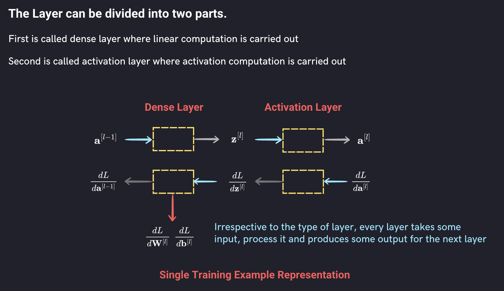
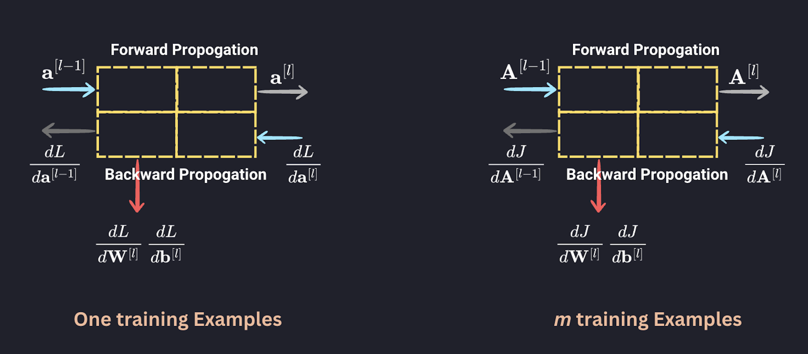

The Layer can be divided into two parts. 
First is called dense layer where linear computation is carried out. Second is called activation layer where activation computation is carried out. There are few more layers used in deep learning and will be introduced as and when we use them in our analysis. 

Irrespective to the type of layer, every layer takes some input, process it and produces some output for the next layer.

We will implement this 2 Layer model using Object Oriented concepts and create a Layer class.



## Layer class

The Layer class serves as the base class for all layers in the neural network.
It has two instance variables: *input* and *output*, initialized to None. They can be accessed (and even modified) both inside methods and from outside the class.

Declaring input and output in __init__ is a design choice for clarity, safety, and consistency, not a technical requirement.
You pass the actual input through forward method call. It will be more clear when we discuss the forward method of the child class of the Layer base class.

```js
class Layer:
  def __init__(self):
    self.input = None
    self.output = None

  def forward(self, input):
    pass

  def backward(self, output_gradient, learning_rate):
    pass
```


```js
L1 = Layer()
print(L1.input)
```
You get `None`

**Forward Method**

The `forward` method takes some input (output of the previous layer) and produces some output to be passed to next layer (Activation Layer in this case). However, the forward method does nothing in the base class as indicated by the pass statement. It is expected to be overridden by a subclasses.

**Bacward Method**

The `backward` method takes some input (output gradient of the next Activation layer) and produces some gradient to be passed to previous layer (Activation Layer in this case). However, this method does nothing and is expected to be overridden by a subclasses.

## Dense Layer - Child Class on Layer

Overall, the `Dense` class represents a fully connected layer in a neural network. It initializes random weights and biases, performs the forward pass by calculating the dot product of the weights and input, and computes the gradients during the backward pass for parameters updates and further backpropagation.

We will implement the `Dense` class in three steps:

Step - 1 : Create a Dense class with `__init__` method. This will initilize the parameters.  
Step - 2 : Implement the `forward` method.  
Step - 3 : Implement the `backward` method.  


### `__init__` method

`Dense` layer is a fully connected layer hence has associated weights and biases initialized in the `__init__()` method on the basis of the sizes of the layer called *output_size* and the size of the previous layer called the *input_size*.

Let us create a subclass 'Dense` on base class `Layer` as below:

```js
class Dense(Layer):
  def __init__(self, input_size, output_size):
    random_state = 2
    rng = np.random.default_rng(random_state)
    self.weights = rng.standard_normal((output_size, input_size))
    self.bias = rng.standard_normal((output_size, 1))
```

Let us create first hidden layer with name `DL1` with size (3, 5) and check the weights

```js
DL1 = Dense(3,5)
DL1.weights
```

Each element of the matrix represents the weight associated with the connection between the neurons of the previous layer and the neurons of the current layer. The bias variable is a randomly initialized matrix of shape (*output_size*, 1). It represents the bias term associated with each neuron in the current layer.

Now, you can try to fetch again the `input` instance variable on hidden layer `HL1`

```js
DL1.input
```

You get an attribute error as ` 'Dense' ` object has no attribute 'input'. It is possible to fetch the instance variables of its parent class through a method `super().__init__()` 

```js
class Dense(Layer):
  def __init__(self, input_size, output_size):
    super().__init__()
    random_state = 2
    rng = np.random.default_rng(random_state)
    self.weights = rng.standard_normal((output_size, input_size))
    self.bias = rng.standard_normal((output_size, 1))
```

```js
DL1.input
```
Now, you get `None` as it is not yet assigned any new data.


### `forward` method

 The `forward()` method takes *input* as the *arguement* and was initialized as `None`  in the `__init__()` method of the parent class.


<div style="display: flex; justify-content: space-around; text-align: center;">
  <div>
  
    For single ($i^{th}$) training example
    
    $$ \mathbf z^{[l](i)} =  \mathbf W^{[l]} \mathbf a^{[l-1](i)} + \mathbf b^{[1]} $$
  
  </div>
  <div>
    For $m$ training examples
    $$ \mathbf Z^{[l]} =  \mathbf W^{[l]} \mathbf A^{[l-1]} + \mathbf b^{[1]} $$
  </div>
</div>

```js
class Dense(Layer):
  def __init__(self, input_size, output_size):
    super().__init__()
    random_state = 2
    rng = np.random.default_rng(random_state)
    self.weights = rng.standard_normal((output_size, input_size))
    self.bias = rng.standard_normal((output_size, 1))

  def forward(self, input):
    self.input = input
    return np.dot(self.weights, self.input) + self.bias

```
## Example : XOR (Exclusive OR) Truth Table

The **XOR (Exclusive OR)** operation is a logical operation that outputs **true (1)** only when the inputs are **different**.  
- If both inputs are the same (`0,0` or `1,1`), the output is **0**.  
- If the inputs are different (`0,1` or `1,0`), the output is **1**.  

## Truth Table

| Input A | Input B | A ⊕ B (XOR) |
|---------|---------|-------------|
|    0    |    0    |      0      |
|    0    |    1    |      1      |
|    1    |    0    |      1      |
|    1    |    1    |      0      |

 **XOR acts like a "difference detector"**: it gives `1` only when the inputs are different.

```js
# XOR Table
X = np.array([[0, 0], [0, 1], [1, 0], [1, 1]]).T
Y = np.array([[0], [1], [1], [0]]).T
```

```js
DL1=Dense(2, 3)
DL2=Dense(3, 2)
DL3=Dense(2, 1)
network = [DL1, DL2, DL3]
```

```js
output = X
for layer in network:
  output = layer.forward(output)
print(output)
```


```js
print(DL1.input)
print(DL2.input)
print(DL3.input)
print(DL3.output)
print(output)
```

You get three different sets of input representing $A^{[0]}, A^{[1]}, A^{[2]}, A^{[3]}$. The output of layer 3 (DL3) is none as we are not storing the layerwise output in the forward method of Dense Layer. But the when you print `output` you get a ventor representing the network output or the prediction. In case we need the layerwise output, we must store these in the forward method.

```js
class Sigmoid(Layer):
  def forward(self, input):
    self.input = input
    return 1 / (1 + np.exp(-self.input))
```

```js
AL3=Sigmoid()
network = [DL1, DL2, DL3, AL3]
output = X
for layer in network:
  output = layer.forward(output)
print(output)
```
```js
class Tanh(Layer):
  def forward(self, input):
    self.input = input
    return np.tanh(self.input)

class ReLU(Layer):
  def forward(self, input):
    self.input = input
    return np.maximum(0, self.input)
```

### `backward` method

The Dense Layer is also responsible for computing the gradient of the cost with respect to parameters ($\frac {d\mathbf J}{\mathbf W^{[l]}} and \frac {d\mathbf J}{\mathbf b^{[l]}}$) for given input of the layer in the backward step. The gradient of the cost with respect to the output ($\frac {d\mathbf J}{\mathbf Z^{[l]}}$) of the forward step of the Layer is the input to the Dense Layer as represented in the Figure. 

These are required to update the weights and biases for the gradient descent 

You also need to compute cost gradient with respect to input to the forward step ($\frac {d\mathbf J}{\mathbf A^{[l-1]}}$). It is passed to the previous layer.

<div class="note-box" align = "center">
In summary, in Dense Layer, we need to compute 
<div style="display: flex; justify-content: space-around; text-align: center;">
  <div>
    $$\frac {d\mathbf J}{\mathbf W^{[l]}}$$
  </div>
  <div>
    $$\frac {d\mathbf J}{\mathbf b^{[l]}}$$
  </div>
  <div>
    $$\frac {d\mathbf J}{\mathbf a^{[l-1]}}$$
  </div>
</div>
for given input to the Layer in Backward Step $$\frac {d\mathbf J}{\mathbf z^{[l]}}$$ (the cost gradient wrt the output of the Dense Layer)

</div>

Let us compute these three gardients one by one:

## Compute Output of the Layer $\frac {d \mathbf J}{d\mathbf a^{[l-1]}}$

The given input vector to the layer is the gradient of the loss wrt the output of the forward step of the layer $\frac {d\mathbf J}{\mathbf z^{[l]}}$

$ d\mathbf a^{[l-1]}= \mathbf W^{[l]T} d\mathbf {z^{[l]}}$

$ d\mathbf W^{[l]}= \frac {1}{m} d\mathbf z^{[l]} \mathbf a^{[l-1]T}$

$ d\mathbf b^{[l]}= \frac{1}{m} \sum\limits_{i = 1}^{m}(d\mathbf z^{[l]})$


The gradient of the loss with respect to the *input* is computed by taking the dot product of the transpose of *self.weights* and *output_gradient*.

The *weights* and *bias* are updated using gradient descent: the *weights* are updated by subtracting the product of *learning_rate* and *weights_gradient*, and the *bias* is updated by subtracting the product of *learning_rate* and *output_gradient*.

The method returns the gradient of the loss with respect to the input, which will be passed to the previous layer in the backward pass.

```js
class Dense(Layer):
  def __init__(self, input_size, output_size):
    super().__init__()
    random_state = 2
    rng = np.random.default_rng(random_state)
    self.weights = rng.standard_normal((output_size, input_size))
    self.bias = rng.standard_normal((output_size, 1))

  def forward(self, input):
    self.input = input
    return np.dot(self.weights, self.input) + self.bias

  def backward(self, output_gradient, learning_rate):
    weights_gradient = np.dot(output_gradient, self.input.T)
    input_gradient = np.dot(self.weights.T, output_gradient)
    self.weights -= learning_rate * weights_gradient
    self.bias -= learning_rate * output_gradient
    return input_gradient
```
It takes two arguments *output_gradient* and *learning_rate*. *output_gradient* represents the gradient of the loss with respect to the *output* of the 'Dense' layer.

The method performs the backward pass by calculating the gradient of the loss with respect to the *weights* and *input* of the `Dense` layer.

The gradient of the loss with respect to the *weights* is computed by taking the dot product of *output_gradient* and the transpose of *self.input*.


The output of the dense layer is passes through the activation layer which produces an output in the forward propagation. The activation layer is also responsible for computing the cost gradients with respect to the input of the activation layer on the basis of the output gradients. There is no trainable parameters in the activation layer.

Let us create different activation classes for different activation functions. Let us 

There are various activation functions inuse in the deep learning. We can generalize the activation layer by initializing the activation function in the `__init__()` method. The activation function is used in the `forward` method to compute the activations.

Let is create an activation class as below:

```js

class Activation(Layer):
  def __init__(self, activation, activation_prime):
    self.activation = activation
    self.activation_prime = activation_prime

  def forward(self, input):
    self.input = input
    return self.activation(self.input)

  def backward(self, output_gradient, learning_rate):
    return np.multiply(output_gradient, self.activation_prime(self.input))

```
**Activation class (subclass of Layer)**

The `Activation` class represents an activation layer that applies a specific activation function to its input.

It inherits from the Layer class, meaning it has access to the input and output variables as well as the forward and backward methods defined in the base class.

Activation Part of Forward Propagation Equations

The `__init__()` method takes two arguments: *activation* and *activation_prime* representing the activation function and its derivative, respectively.

The forward method overrides the base class method. It takes an input, assigns it to the input variable, applies the activation function (self.activation) to the input, and returns the result.

$\mathbf A^{[l]} = g(\mathbf Z^{[l]})$

The backward method also overrides the base class method. It takes output_gradient and learning_rate as arguments.

It calculates the gradient of the loss with respect to the input of the activation layer by multiplying output_gradient with the derivative of the activation function evaluated at the input (self.activation_prime(self.input)).

The result is then returned.

Now we are ready to create the classes for different activation functions. Let us start with `Tanh` class based on the `Activation` class. Just to recall that the `Activation` class is subclass of the `Layer` base class.

```js
class Tanh(Activation):
  def __init__(self):
    def tanh(x):
      return np.tanh(x)

    def tanh_prime(x):
      return 1 - np.tanh(x) ** 2

    super().__init__(tanh, tanh_prime)
```
**Tanh class (subclass of Activation):**

The Tanh class inherits from the Activation class, which means it inherits the properties and methods of the base class (`Layer`) as well as the `Activation` class.

The `__init__()` method is defined to initialize the Tanh activation layer.
Inside the `__init__()` method, two inner functions, tanh and tanh_prime, are defined.

The `tanh` function takes an input x and applies the hyperbolic tangent function (np.tanh) to it. This function returns the tanh of x.

The `tanh_prime` function takes an input x and calculates the derivative of the hyperbolic tangent function, which is $1 - (np.tanh(x))^2$. This function returns the derivative of tanh with respect to x.

Finally, the `super().__init__` line calls the constructor of the superclass (Activation) and passes the tanh and tanh_prime functions as arguments. This initializes the Activation superclass with the tanh activation function and its derivative.

By creating the Tanh class, the code extends the functionality of the Activation class by providing a specific activation function (tanh) and its derivative. This allows the Tanh activation layer to be used in a neural network for non-linear transformations during the forward and backward passes.

```js
class Sigmoid(Activation):
  def __init__(self):
    def sigmoid(x):
      return 1 / (1 + np.exp(-x))

    def sigmoid_prime(x):
      s = sigmoid(x)
      return s * (1 - s)

    super().__init__(sigmoid, sigmoid_prime)
```

## Example of the Activation Layer

Let us understand the passing the function to the Super Layer of the `Activation` Layer. In the following example, we will create a `Square` subclass on the `Activation` class and implement the Square Function thrugh the super class. We can pass the two inner functions defined in `__init__` method through the `super().__init__` method. This initilaizes the superclass `Activation` or These functions are set as instance variables in the `__init__` method of `Activation` class.

```js

class Square(Activation):
  def __init__(self):
    def square(x):
      return x*x

    def square_prime(x):
      return 1

    super().__init__(square, square_prime)
```

```js

Layer=Square()
Layer.forward(2)
Layer.backward(5,0.07)

```

```js
def mse(y_true, y_pred):
  return np.mean(np.power(y_true - y_pred, 2))

def mse_prime(y_true, y_pred):
  return 2 * (y_pred - y_true) / np.size(y_true)

def binary_cross_entropy(y_true, y_pred):
  return np.mean(-y_true * np.log(y_pred) - (1 - y_true) * np.log(1 - y_pred))

def binary_cross_entropy_prime(y_true, y_pred):
  return ((1 - y_true) / (1 - y_pred) - y_true / y_pred) / np.size(y_true)
```