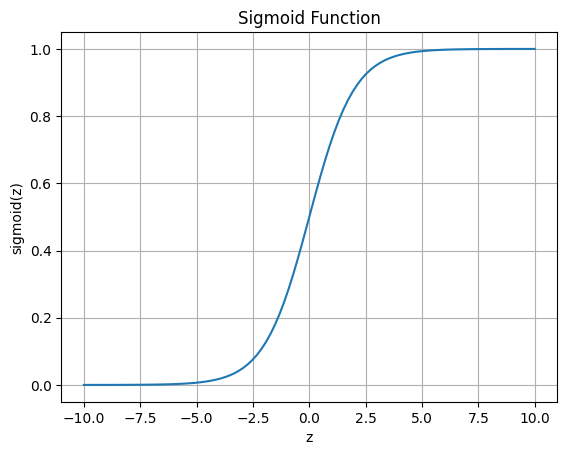
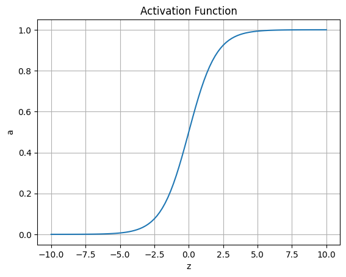
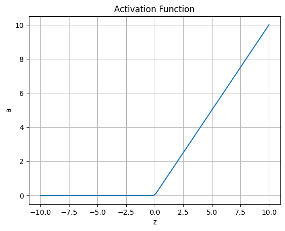
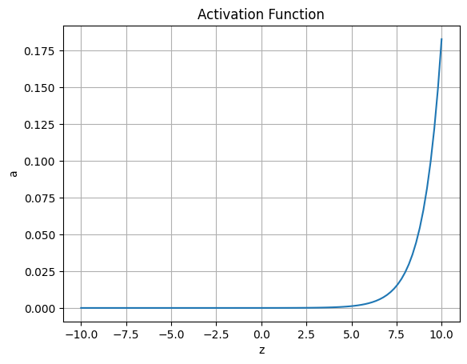
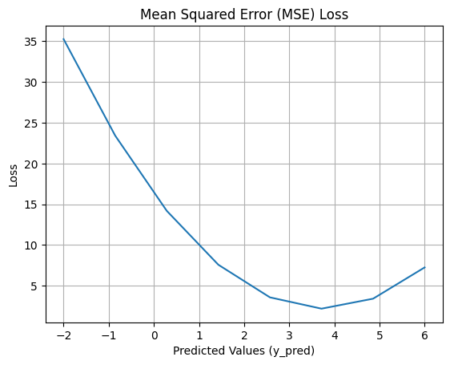
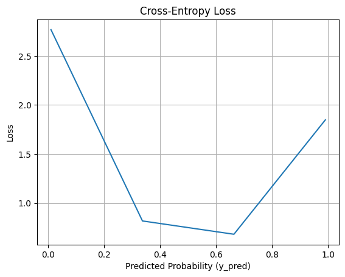
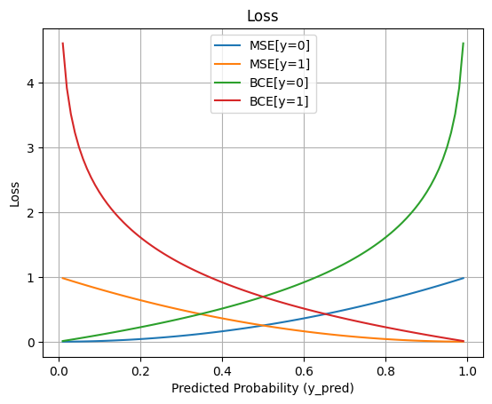

## Mathematical Functions  
## Commonly Used Functions  

$$y=f(x)$$
- Linear Function
$$f(x) = wx+b$$
$$f(x) = max(0,x)$$
- Quadratic Function
$$f(x) = 4ax^2+b$$
- Exponential Function
$$f(x) = \frac{1}{1+e^{-x}}$$

$$f(x_i) = \frac {e^{x_i}}{\sum_{j=1}^C{e^{x_j}}}$$

- Trignometric Function
$$f(x) = tan^{-1}(x)$$
- Logrithmic Function
$$f(x) = log(x)$$
## Sigmoid Function
Implement `np.exp()` and `math.exp()` for the sigmoid function and compare.

$$sigmoid(z) = \frac{1}{1+e^{-z}}$$

- It takes an input value x and outputs a value between 0 and 1, which can be interpreted as a probability.
- The function has an S-shaped curve, mapping the input values to a smooth, non-linear range.
- The sigmoid function is commonly used in the last layer of a binary classification task, where the output represents the probability of belonging to a certain class.
```js
import math
```
```js
def sigmoid(z):
  return 1/(1+math.exp(-z))
sigmoid(1)
```
0.7310585786300049  
<span style="color:brown"> **Cannot pass array as an arguement**</span>

Give it a try to pass array to find sigmoid function of all the array elements.
```js
#a=np.array([1,2,3])
#sigmoid(a)
```
```js
def sigmoid(z):
  return 1/(1+np.exp(-z))
  ```
  ```js
# Example
x = np.array([-1, 0, 1])
output = sigmoid(x)
print(output)
```
[0.26894142 0.5        0.73105858]

# Ploting a Sigmoid Function
```js
import matplotlib.pyplot as plt
```
```js
# Generate z values
z = np.linspace(-10, 10, 100)

# Compute sigmoid function for each z value
a = sigmoid(z)

# Plot the sigmoid function
plt.plot(z, a)
plt.title('Sigmoid Function')
plt.xlabel('z')
plt.ylabel('sigmoid(z)')
plt.grid(True)
plt.show()
```

  

In this code, we define the sigmoid function that calculates the sigmoid activation using the formula 1 / (1 + np.exp(-x)). The np.linspace() function generates 100 equally spaced values between -10 and 10 as the x values. We then compute the sigmoid function values for each x value using sigmoid(x).

Finally, we use plt.plot() to plot the x values against the sigmoid function values (y). The remaining lines of code add a title to the plot, label the x and y axes, enable the grid, and display the plot using plt.show().

- use `plt.plot()` to plot the z values against the sigmoid function values (y).
- `plt.title()` adds a title to the plot
- `plt.xlabel()` and `plt.ylabel()` label the x and y axes
- `plt.grid(True)` enable the grid
- Finally the plot is displayed `plt.show()`
When you run this code, it will generate a plot showing the sigmoid function curve. The sigmoid function is an S-shaped curve that ranges between 0 and 1, and it is commonly used as an activation function in neural networks.
```js
def plot(x,y):
  plt.plot(x, y)
  plt.title('Activation Function')
  plt.xlabel('z')
  plt.ylabel('a')
  plt.grid(True)
  plt.show()
  ```
  ```js
plot(z,a)
```
  

Implement the following equation

$z = w^{T}x+b$

Where,
- $w$ is the weight array of shape (2, 1)
- $x$ is the feature array of shape (2, 5)
- $b$ is a scalar.

$$sigmoid(z) = \frac{1}{1+e^{-z}}$$
```js
X=np.arange(10).reshape(2,5)*100
w=np.random.rand(2).reshape(2,1)
b=np.random.randint(2,6)
z=np.dot(w.T,X)+b
print(z)
a=sigmoid(z)
```
[[ 54.79026997 118.08057778 181.37088559 244.6611934  307.95150121]]

# ReLU (Rectified Linear Unit)
##ReLU (Rectified Linear Unit)
- It takes an input value x and returns x if it is positive, and 0 otherwise.
- The ReLU function introduces non-linearity to the network by mapping negative values to 0, while leaving positive values unchanged.
- ReLU is a popular choice due to its simplicity and ability to mitigate the vanishing gradient problem.
```js
def relu(x):
    return np.maximum(0, x)
```
```js
# Let us consider the three observations
x = np.array([-1, 0, 1])
output = relu(x)
print(output)
```
[0 0 1]  
```js
# Generate z values
z = np.linspace(-10, 10, 100)

# Compute ReLU function for each z value
a = relu(z)

# Plot the ReLU function
plot(z,a)
```
  

# Softmax

- The softmax function is commonly used in multi-class classification tasks.
- Given an input vector x, the softmax function computes the probabilities for each class by exponentiating and normalizing the values.
- The softmax function is defined as follows:

$$P(C_i) = \frac {e^{z_i}}{\sum_{j=1}^C{e^{z_j}}}$$

- The output of the softmax function is a probability distribution, ensuring that the sum of the probabilities across all classes is equal to 1.
```js
def softmax(x, dim):
    x_exp=np.exp(x)
    if(dim>1):
      x_sum=np.sum(x_exp, axis=1).reshape(x.shape[0],1)
    else:
      x_sum=np.sum(x_exp)
    #print(x_sum)
    return x_exp/x_sum
  ```
  ```js
x = np.array([[9, 2, 5, 0, 0], [7, 5, 0, 0 ,0], [7, 5, 0, 0 ,0]]).T
print(x.shape)
print(x)
s=softmax(x, 2)
print(s)
```
(5, 3)  
[[9 7 7]  
 [2 5 5]  
 [5 0 0]  
 [0 0 0]  
 [0 0 0]]  
[[0.78698604 0.10650698 0.10650698]  
 [0.0242889  0.48785555 0.48785555]  
 [0.98670329 0.00664835 0.00664835]  
 [0.33333333 0.33333333 0.33333333]  
 [0.33333333 0.33333333 0.33333333]]  
```js
# Generate x values
a = np.linspace(-10, 10, 100)

# Compute Softmax function for each x value
y = softmax(a,1)

print(np.sum(y))
print(y)

# Plot the Softmax function
plot(a,y)
```
1.0  
[3.77029476e-10 4.61436094e-10 5.64739054e-10 6.91168729e-10  
 8.45902561e-10 1.03527708e-09 1.26704739e-09 1.55070475e-09  
 1.89786526e-09 2.32274554e-09 2.84274493e-09 3.47915801e-09  
 4.25804662e-09 5.21130715e-09 6.37797672e-09 7.80583179e-09  
 9.55334469e-09 1.16920781e-08 1.43096155e-08 1.75131483e-08  
 2.14338646e-08 2.62323225e-08 3.21050242e-08 3.92924637e-08  
 4.80889749e-08 5.88547851e-08 7.20307667e-08 8.81564912e-08  
 1.07892326e-07 1.32046476e-07 1.61608081e-07 1.97787724e-07  
 2.42067002e-07 2.96259203e-07 3.62583560e-07 4.43756133e-07  
 5.43101031e-07 6.64686542e-07 8.13491735e-07 9.95610352e-07  
 1.21850036e-06 1.49128937e-06 1.82514839e-06 2.23374935e-06  
 2.73382492e-06 3.34585378e-06 4.09489921e-06 5.01163548e-06  
 6.13360401e-06 7.50675071e-06 9.18730750e-06 1.12440951e-05  
 1.37613414e-05 1.68421305e-05 2.06126243e-05 2.52272289e-05  
 3.08749175e-05 3.77869697e-05 4.62464418e-05 5.65997592e-05  
 6.92709019e-05 8.47787680e-05 1.03758422e-04 1.26987104e-04  
 1.55416054e-04 1.90209471e-04 2.32792185e-04 2.84908007e-04  
 3.48691141e-04 4.26753580e-04 5.22292070e-04 6.39219023e-04  
 7.82322732e-04 9.57463460e-04 1.17181342e-03 1.43415049e-03  
 1.75521768e-03 2.14816306e-03 2.62907820e-03 3.21765712e-03  
 3.93800281e-03 4.81961426e-03 5.89859447e-03 7.21912894e-03  
 8.83529506e-03 1.08132767e-02 1.32340745e-02 1.61968229e-02  
 1.98228499e-02 2.42606455e-02 2.96919425e-02 3.63391588e-02  
 4.44745056e-02 5.44311347e-02 6.66167816e-02 8.15304625e-02  
 9.97829100e-02 1.22121583e-01 1.49461275e-01 1.82921579e-01]  
 
  

# Mean Squared Error (MSE) Loss Function

Mean Squared Error (MSE) Loss Function:
- The Mean Squared Error (MSE) loss function is widely used for regression problems.
- It calculates the average squared difference between the predicted values and the true values.
- For a set of m predictions $y_{pred}$ and corresponding true values $y_{true}$, the MSE loss is computed as:

$$L_{mse}(\hat{y},y) = \frac{1}{2m}\sum_{i=0}^m( \hat{y}^{(i)}-y^{(i)})^2$$

- The MSE loss penalizes larger errors more than smaller errors due to the squaring operation.
- Minimizing the MSE loss encourages the model to produce predictions that are closer to the true values.
```js
def mse_loss(y, yhat):
  loss = np.dot(abs(y-yhat).T, abs(y-yhat))/y.shape[0]
  #Note that dot product gives you onle scalar.
  # We have used y.shape[0] to calculate mean
  #loss=np.mean((y - yhat) ** 2)
  return np.mean(loss)
  ```
  ```js
# Consider an example for three predictions
y_true = np.array([1, 2, 3, 4])
y_pred = np.array([1.5, 2.3, 3.2, 3.9])
#Try the below statement to show the broadcasting
#y_pred = np.array([1.5])
#Note that the program will throw an error if the shape of both
#y is not same except when either y_pred or y_true is one to facilitate the broadcating
loss = mse_loss(y_true, y_pred)
print(loss)
```
0.0975 
```js
# Generate y_true values
y_true = np.array([2,3,4,6])

# Generate a range of y_pred values
y_pred = np.linspace(-2, 6, 8)

# Compute MSE loss for each y_pred value
loss = [mse_loss(y_true, y) for y in y_pred]

#Broadcast the y_pred in the mse_loss function to all the elements of y_true.
#You can change the number of elements in the y_true from 1 to 10 (say)

# Plot the MSE loss curve
plt.plot(y_pred, loss)
plt.title('Mean Squared Error (MSE) Loss')
plt.xlabel('Predicted Values (y_pred)')
plt.ylabel('Loss')
plt.grid(True)
plt.show()
```
  

- [...]: This is a list comprehension, which is a concise way to create a new list by iterating over a sequence (in this case, the y_pred values) and performing a specific operation for each element.

- The list comprehension loss = [mse_loss(y_true, y) for y in y_pred] iterates over each y value in y_pred, computes the Mean Square Error loss using mse_loss(y_true, y), and stores the results in the loss list.

# Binary Cross-Entropy Loss Function

- The Binary Cross-Entropy loss function is commonly used for binary classification problems.
- It measures the dissimilarity between the predicted probabilities and the true binary labels.
- For a set of m predictions y_pred and corresponding true labels y_true, the Binary Cross-Entropy loss is computed as:


$$L_{BCE} = -\frac{1}{m} \sum_{i=0}^m(ylog(\hat{y}) + (1 - y)log(1 - \hat{y}))$$

- The BCE loss penalizes models that have large differences between the predicted probabilities and the true labels.
- Minimizing the BCE loss encourages the model to assign higher probabilities to the correct class.
```js
def binary_cross_entropy(y_true, y_pred):
    return -np.mean(y_true * np.log(y_pred) + (1 - y_true) * np.log(1 - y_pred))
  ```
```js

y_true = np.array([0, 1, 1])
y_pred = np.array([0.3, 0.9, 0.7])
loss = binary_cross_entropy(y_true, y_pred)
print(loss)
```
0.27290346784509706  
```js
# Generate y_true and y_pred values
y_true = np.array([1, 0, 1, 0, 1])
y_pred = np.linspace(0.01, 0.99, 4)

# Compute Cross-Entropy loss for each y_true and y_pred pair
loss = [binary_cross_entropy(y_true, y) for y in y_pred]

# Plot the Cross-Entropy loss
plt.plot(y_pred, loss)
plt.title('Cross-Entropy Loss')
plt.xlabel('Predicted Probability (y_pred)')
plt.ylabel('Loss')
plt.grid(True)
plt.show()
```
  

# Categorical Cross-Entropy Loss Function


- The Categorical Cross-Entropy loss function is commonly used for multi-class classification problems.
- It measures the dissimilarity between the predicted class probabilities and the true class labels.
- For a set of m predictions y_pred and corresponding true labels y_true, the Categorical Cross-Entropy loss is computed as:

$$L_{CCE} = -\frac{1}{m} \sum (y) log(\hat{y})$$

- The CCE loss penalizes models that have low probabilities for the correct class.
- Minimizing the CCE loss encourages the model to assign higher probabilities to the correct classes.


# MSE and BCE Loss Comparison
```js
yhat=np.linspace(0.01, 0.99, 100)
#MSE Loss
mse_y_0=np.square(yhat)
mse_y_1=np.square(1-yhat)

#BCE Loss
bce_y_0=-np.log(1 - yhat)
bce_y_1=-np.log(yhat)

# Plot the loss
plt.subplot(1, 1, 1)
plt.plot(yhat, mse_y_0)
plt.plot(yhat, mse_y_1)
plt.title('Loss')
plt.xlabel('Predicted Probability (y_pred)')
plt.ylabel('Loss')


#plt.subplot(1, 2, 2)
plt.plot(yhat, bce_y_0)
plt.plot(yhat, bce_y_1)

plt.legend(["MSE[y=0]","MSE[y=1]", "BCE[y=0]","BCE[y=1]"])
plt.grid(True)

plt.show()
```
  

# Linear Algebra Functions
# Normalization

Row Normalization is done by dividing each element of row of a given vector x by its norm based on row.

It is changing x to $ \frac{x}{\| x\|} $.

We get a column vector of norm if we take the square root of the sum of squares of each row elements. Then divide each row by its norm to normalize rows.


$$\| x\| = \text{np.linalg.norm(x, axis=1, keepdims=True)}$$

With `keepdims=True` the result will broadcast correctly against the original x.

`axis=1` means you are going to get the norm in a row-wise manner. If you need the norm in a column-wise way, you would need to set `axis=0`.
```js
x = np.array([[0, 3, 4],[1, 6, 4]])
x_norm=np.linalg.norm(x, axis=1, keepdims=True)
x=x/x_norm
print("Norm ", x_norm, "\nnormalizeRows(x) = ", x)
```

## Determinant and Inverse

```js
x = np.array([[0, 3, 4],[1, 6, 4], [3,2,7]])
```
```js
np.linalg.det(x)
```
```js
np.linalg.inv(x)
```